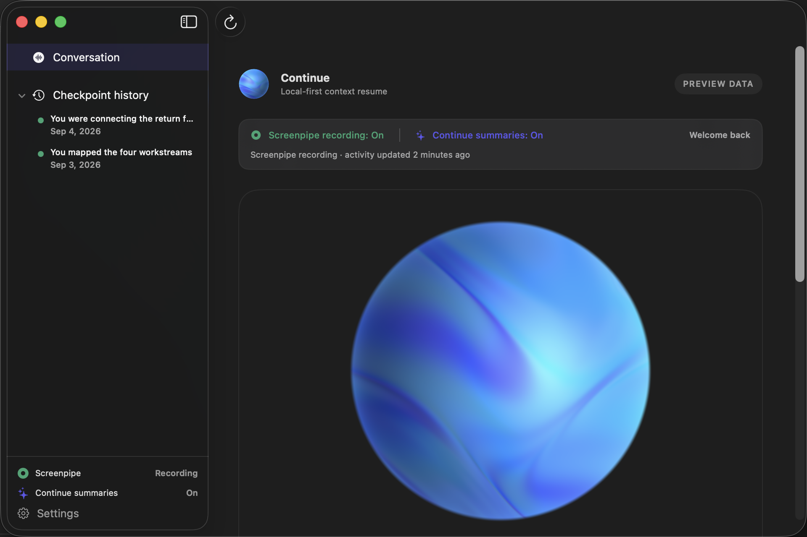
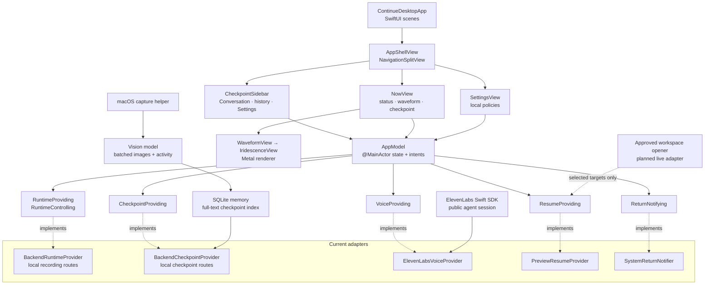

# continue.ai

Continue is a context-resume assistant with a native macOS client and a local
web service. The service captures screen activity in bounded batches, sends the
screenshots and a privacy-filtered activity timeline to the configured vision
model, and stores the resulting checkpoint summaries locally.

The product decisions are recorded in
[`docs/PRODUCT_DECISIONS.md`](docs/PRODUCT_DECISIONS.md). The longer research
and implementation plan—including data contracts, security boundaries, trusted
reference repositories, and future integration work—is in
[`docs/IMPLEMENTATION_ARCHITECTURE.md`](docs/IMPLEMENTATION_ARCHITECTURE.md).

## Run the macOS desktop preview

Requirements:

- macOS 14 or later.
- Swift 6 toolchain (Xcode 16 or the matching Command Line Tools).
- A Metal-capable Mac for the iridescent waveform renderer.

From the repository root, run:

```bash
apps/macos/scripts/run-app.sh
```

The launcher builds the Swift package into an ignored local `Continue.app`
bundle, closes only an existing instance of that bundle, and opens the focused
Continue window with its menu-bar item. Quit Continue from the app or its
menu-bar item when you finish.

The native client uses the local web harness for live recording status and
Start/Stop capture commands. Start the web harness in a second terminal before
using those controls:

```bash
corepack pnpm dev:web
```

Checkpoint summaries, persistent SQLite memory, and ElevenLabs voice are live.
Workspace resume remains a preview adapter. Set `OPENAI_API_KEY` in the
repository `.env` before recording and `ELEVENLABS_AGENT_ID` before starting
voice. Set `CONTINUE_BACKEND_URL` when the web harness is not at the default
`http://127.0.0.1:3000`; the launcher records these values in the local app
bundle so LaunchServices preserves them.

Useful native commands:

```bash
# Build and open the local macOS app bundle.
apps/macos/scripts/run-app.sh

# Compile only the desktop executable.
swift build --package-path apps/macos --product ContinueApp

# Run the deterministic core checks (17 checks at the time of writing).
swift run --package-path apps/macos ContinueCoreChecks

# Run Swift checks, build with warnings-as-errors, then run workspace checks.
apps/macos/scripts/check.sh
```

The final command also checks the web workspaces. If an upstream web commit has
introduced a dependency that is not yet declared in `apps/web/package.json`,
the web typecheck can fail even when the macOS checks pass; fix that dependency
in the web owner's change before treating the full command as green.

To open the package in Xcode for previews or signing work:

```bash
open apps/macos/Package.swift
```

## Review the UI

The left sidebar contains the Conversation destination, a disclosure-controlled
Checkpoint history list, and the Screenpipe, summary, and Settings controls.
The native `NavigationSplitView` sidebar can be hidden with the standard macOS
sidebar button. The main screen puts the live voice state and 360-point
waveform at the center; written checkpoint evidence and explicit actions remain
below it.



To replace the checked-in screenshot after a UI change, start the preview and
capture only its focused window:

```bash
screencapture -i -w docs/assets/continue-macos-preview.png
```

The interactive capture lets you select the Continue window. Do not capture the
whole desktop when it contains unrelated personal or collaborator content.

## Architecture

The native client keeps the SwiftUI composition layer separate from service
implementations. `AppModel` runs on the main actor, owns view state, and sends
user intents through narrow protocols. Runtime and checkpoint adapters talk to
the local web service. Voice and resume adapters are still previews.



The boundaries enforce these rules:

- Screenpipe remains the source of captured activity; Continue consumes bounded
  observations and stores interpreted checkpoint records, not raw screenshots
  or microphone audio.
- The runtime coordinator decides whether the user is away or returning;
  views do not infer that state independently.
- Voice starts only after an explicit user action and exposes connecting,
  listening, thinking, speaking, muted, and failed states as both animation and
  text.
- Resume proposals enter an approval view. Continue never silently focuses an
  application, reopens a target, submits a form, or executes a shell command.

## Web harness and worker

Install the workspace dependencies before using the web commands:

```bash
pnpm install
pnpm dev:web
pnpm dev:worker
```

The optional demo seed is:

```bash
pnpm seed:demo
```

## ElevenLabs voice and text conversations

Create a public ElevenLabs agent, then add only its ID to the repository-level
`.env` file:

```bash
ELEVENLABS_AGENT_ID="agent_..."
```

Restart `pnpm dev:web`. When a checkpoint exists, **Read summary aloud** starts
an explicit microphone session and asks the agent to speak the same committed
summary shown on screen. **Start text chat**, or submitting a typed question
while disconnected, starts a text-only session without requesting microphone
access. The transcript remains visible below the controls.

The app injects the current checkpoint and the 20 most recent checkpoints when
each conversation starts, so the current briefing and recent-history questions
work without editing the agent prompt. It passes `current_briefing`, `summary`,
`project`, `task`, `current_task`, `last_action`, and `next_action` as dynamic
variables as well, for agents that use them in a first message or prompt.

For history that grows beyond the initial context, add these case-sensitive
**Client** tools to the agent in the ElevenLabs dashboard and enable **Wait for
response**. The browser implementations are already registered:

- `get_last_session` — no parameters.
- `get_session_context` — optional string parameter `checkpoint_id`.
- `search_past_summaries` — required string parameter `query`; optional number
  parameter `limit`.
- `request_resume_workspace` — no parameters. This only reports that local
  confirmation is required; it never opens anything itself.

A concise agent instruction is: “Use the injected Continue checkpoint context
for the current briefing. For older work, call `search_past_summaries`. Never
invent a checkpoint, and say when no matching summary exists.” The tool searches
the complete local SQLite history by topic or date instead of limiting retrieval
to the newest checkpoints.

## Persistent memory

Checkpoint summaries are stored in `data/memory.sqlite` using WAL mode so the
web service and capture worker can read and write safely at the same time. The
database is local and ignored by Git. Existing `data/checkpoints.json` records
are imported idempotently on startup; the JSON file is left untouched as a
recoverable legacy copy. New SQLite checkpoints are not capped at 100 entries.

The search index covers project, task, summary, last action, next action, key
activities, and checkpoint dates. `search_past_summaries` also understands
“today,” “yesterday,” “last week,” “last month,” weekday names, and ISO dates.
Set `CONTINUE_MEMORY_PATH` to an absolute path only when a different local
database location is needed. Run `pnpm verify:memory` for a disposable end-to-end
check of JSON migration, durable reopening, indexed retrieval, and the exact
ElevenLabs history interface.
