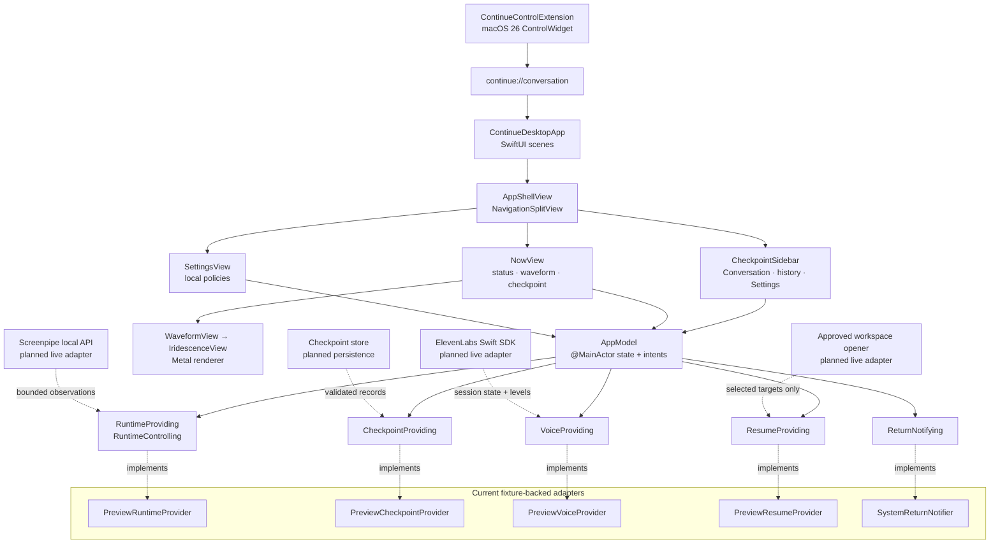

# continue.ai

Continue is a local-first context-resume assistant. The repository contains a
fixture-backed native macOS preview and a separate web harness. The macOS
preview presents a voice-first return checkpoint without focusing another app,
reopening windows, or writing raw screen/audio data to Continue's store.

The product decisions are recorded in
[`docs/PRODUCT_DECISIONS.md`](docs/PRODUCT_DECISIONS.md). The longer research
and implementation plan—including data contracts, security boundaries, trusted
reference repositories, and future integration work—is in
[`docs/IMPLEMENTATION_ARCHITECTURE.md`](docs/IMPLEMENTATION_ARCHITECTURE.md).

## Run the macOS desktop preview

Requirements:

- macOS 14 or later.
- Swift 6 toolchain (Xcode 16 or the matching Command Line Tools).
- A Metal-capable Mac for the iridescent waveform renderer.

From the repository root, run:

```bash
apps/macos/scripts/run-app.sh
```

The script builds a local `ContinuePreview.app` in the macOS user cache,
embeds the Control Center extension, signs both bundles for local use, opens the
Continue window, and adds a Continue item to the menu bar. Quit Continue from
its menu-bar item when you finish using the preview.

The current native client is intentionally fixture-backed. `ContinueDesktopApp`
injects `PreviewRuntimeProvider`, `PreviewCheckpointProvider`,
`PreviewVoiceProvider`, and `PreviewResumeProvider`, so the window can be
reviewed without Screenpipe, model credentials, a live voice SDK, a database,
or a real workspace opener. The `PREVIEW DATA` label identifies this state.

Useful native commands:

```bash
# Compile only the desktop executable.
swift build --package-path apps/macos --product ContinueApp

# Build and validate the Control Center extension without opening the app.
apps/macos/scripts/run-app.sh --no-open

# Run the deterministic core checks (17 checks at the time of writing).
swift run --package-path apps/macos ContinueCoreChecks

# Run Swift checks, build with warnings-as-errors, then run workspace checks.
apps/macos/scripts/check.sh
```

The final command also checks the web workspaces. If an upstream web commit has
introduced a dependency that is not yet declared in `apps/web/package.json`,
the web typecheck can fail even when the macOS checks pass; fix that dependency
in the web owner's change before treating the full command as green.

To open the package in Xcode for previews or signing work:

```bash
open apps/macos/Package.swift
```

## Add the Control Center button

On macOS 26 or later, Continue supplies an **Open Continue** control with the
waveform icon. The button opens the app directly on the current conversation
and checkpoint. It does not start recording, generate a summary, or resume
another application.

The checked-in bundle script compiles, embeds, and registers the extension for
structural verification with the Command Line Tools. The system gallery accepts
an Apple development-signed extension whose App Intents metadata was extracted
by full Xcode. The ad-hoc command-line preview therefore does not appear in the
gallery. To add the button:

1. Open `apps/macos/ContinueMac.xcodeproj` with Xcode 26 or later.
2. Select the same Apple development team for **Continue** and
   **ContinueControlExtension**.
3. Run the **Continue** scheme once.
4. Open macOS Control Center and choose **Edit Controls**.
5. Search for **Continue**, then add **Open Continue** to Control Center or the
   menu bar.

The generated project is defined by `apps/macos/project.yml`. After changing
that file, regenerate the project with:

```bash
brew install xcodegen
apps/macos/scripts/generate-xcode-project.sh
```

macOS 14 and macOS 15 can still run the main app and menu-bar item, but those
releases do not support third-party Control Center controls.

## Review the UI

The left sidebar contains the Conversation destination, a disclosure-controlled
Checkpoint history list, and the Screenpipe, summary, and Settings controls.
The native `NavigationSplitView` sidebar can be hidden with the standard macOS
sidebar button. The main screen puts the live voice state and 360-point
waveform at the center; written checkpoint evidence and explicit actions remain
below it.


To replace the checked-in screenshot after a UI change, start the preview and
capture only its focused window:

```bash
screencapture -i -w docs/assets/continue-macos-preview.png
```

The interactive capture lets you select the Continue window. Do not capture the
whole desktop when it contains unrelated personal or collaborator content.

## Architecture

The native preview keeps the SwiftUI composition layer separate from service
implementations. `AppModel` runs on the main actor, owns view state, and sends
user intents through narrow protocols. The preview adapters implement those
same protocols with deterministic data so the UI can be tested before live
Screenpipe, model, voice, persistence, and resume integrations land.



The boundaries enforce these rules:

- Screenpipe remains the source of captured activity; Continue consumes bounded
  observations and stores interpreted checkpoint records, not raw screenshots
  or microphone audio.
- The runtime coordinator decides whether the user is away or returning;
  views do not infer that state independently.
- Voice starts only after an explicit user action and exposes connecting,
  listening, thinking, speaking, muted, and failed states as both animation and
  text.
- Resume proposals enter an approval view. Continue never silently focuses an
  application, reopens a target, submits a form, or executes a shell command.

## Web harness and worker

Install the workspace dependencies before using the web commands:

```bash
pnpm install
pnpm dev:web
pnpm dev:worker
```

The optional demo seed is:

```bash
pnpm seed:demo
```
