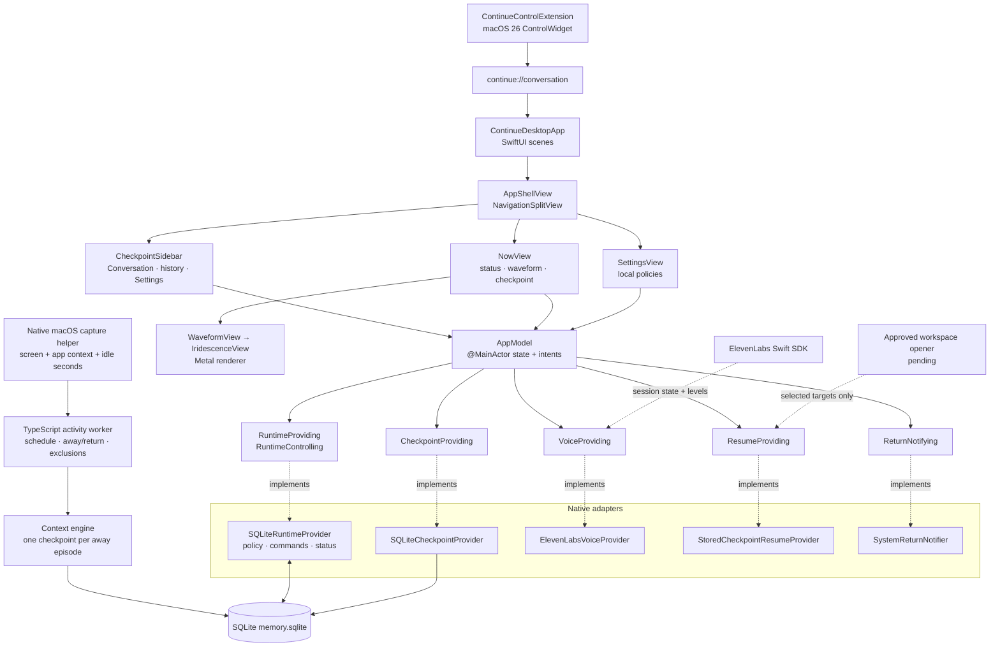

# continue.ai

Continue is a local-first context-resume assistant. The native macOS client is
the product's only user interface; the repository also contains an activity
worker and a headless local Next.js web harness that supplies its API routes.
The worker starts the native capture helper, detects away and return
transitions, and writes compact checkpoints to SQLite. The macOS client writes
tracking policy to the same database, reads worker status and checkpoints, and
uses the local web backend for chat and ElevenLabs speech. It presents a
voice-first return checkpoint without focusing another app, reopening windows,
or writing raw screen/audio data to Continue's store.

The product decisions are recorded in
[`docs/PRODUCT_DECISIONS.md`](docs/PRODUCT_DECISIONS.md). The longer research
and implementation plan—including data contracts, security boundaries, trusted
reference repositories, and future integration work—is in
[`docs/IMPLEMENTATION_ARCHITECTURE.md`](docs/IMPLEMENTATION_ARCHITECTURE.md).

## Run the macOS desktop preview

Requirements:

- macOS 14 or later.
- Swift 6 toolchain (Xcode 16 or the matching Command Line Tools).
- A Metal-capable Mac for the iridescent waveform renderer.
- Node.js 24 and pnpm 9 when seeding or generating checkpoints through the
  TypeScript memory package.

To open the native interface without starting the live activity worker, run:

```bash
apps/macos/scripts/run-app.sh
```

The launch script automatically starts and health-checks the private local API
service when needed. It does not expose a browser interface. For backend-only
development, you can still run `corepack pnpm dev:service` manually.

The script builds a local `ContinuePreview.app` in the macOS user cache,
embeds the Control Center extension, signs both bundles for local use, opens the
Continue window, and adds a Continue item to the menu bar. Quit Continue from
its menu-bar item when you finish using the preview.

The app intentionally shows an empty state when `data/memory.sqlite` has no
checkpoint. To review the complete interface without starting capture or
configuring a model, seed one deterministic checkpoint before opening the app:

```bash
pnpm install
pnpm seed:demo
apps/macos/scripts/run-app.sh
```

To exercise live activity tracking, run the worker and app from the repository
root in two terminals. The worker remains active and the app remains a native,
independently restartable process:

```bash
# Terminal 1
pnpm install
pnpm dev:worker
```

```bash
# Terminal 2
apps/macos/scripts/run-app.sh
```

macOS requests Screen Recording and Accessibility access when the worker starts
the capture helper. Approve those permissions for the process shown by macOS,
then restart `pnpm dev:worker`. `OPENAI_API_KEY` must be set in `.env` before a
live away episode can be summarized. The app can still open without the worker;
it reports that the activity-worker heartbeat is unavailable.

The native client uses `SQLiteRuntimeProvider` and
`SQLiteCheckpointProvider`. `AppModel` persists the saved tracking policy when
monitoring starts, the worker applies it on its next capture cycle, and both
processes coordinate through `data/memory.sqlite`. The checkpoint provider
shows an empty state when no record exists instead of substituting fixture
data. `StoredCheckpointResumeProvider` validates targets from the database,
and `ElevenLabsVoiceProvider` uses the local voice endpoint without bundling
the API key in the macOS app.

Useful native commands:

```bash
# Compile only the desktop executable.
swift build --package-path apps/macos --product ContinueApp

# Build and validate the Control Center extension without opening the app.
apps/macos/scripts/run-app.sh --no-open

# Run the deterministic core checks (26 checks at the time of writing).
swift run --package-path apps/macos ContinueCoreChecks

# Write through TypeScript and read the same temporary database through Swift.
pnpm verify:database

# Verify policy behavior, worker transitions, and the bidirectional Swift/TypeScript bridge.
pnpm verify:runtime

# Run Swift checks, build with warnings-as-errors, then run workspace checks.
apps/macos/scripts/check.sh
```

The final command also checks the web workspaces. If an upstream web commit has
introduced a dependency that is not yet declared in `apps/web/package.json`,
the web typecheck can fail even when the macOS checks pass; fix that dependency
in the web owner's change before treating the full command as green.

To open the package in Xcode for previews or signing work:

```bash
open apps/macos/Package.swift
```

## Configure local policies

Settings are saved in `UserDefaults` under `continue.app-preferences.v1` and
restored the next time Continue opens. The preview exposes:

- **Record activity with Screenpipe** and **Create return summaries** as
  separate switches, so pausing summaries never stops raw capture.
- **Create checkpoints** to choose automatic checkpoints, manual **I'm stepping
  away** checkpoints, or both.
- **Away threshold** from 1 to 60 minutes before a return counts as a
  checkpoint-worthy break.
- **Tracking schedule** to limit activity to a daily window, including windows
  that cross midnight.
- **Observation window** of 5, 15, 30, or 60 minutes of source context for a
  summary.
- **Excluded applications** that are trimmed, deduplicated case-insensitively,
  and skipped when summaries are created.
- **Checkpoint retention** of 1, 7, or 30 days for interpreted summaries.
- **Screenpipe raw-data retention** is stored as a forward-compatible policy.
  The current streaming helper does not persist raw frames, so there is no
  local raw-capture history for Continue to prune in this build.
- **Voice conversations** enabled or disabled separately from capture.

Older saved payloads are decoded with conservative defaults for any preference
that does not exist yet, so upgrades do not reset the controls a person set.

## Live integrations

The native app and TypeScript worker use the same SQLite database. Set
`CONTINUE_MEMORY_DATABASE_PATH` when the database is outside the repository;
the preview script automatically points the app at `data/memory.sqlite`. The
database contains compact checkpoints plus three coordination tables:
`runtime_policy` for saved settings, `runtime_commands` for one-time actions
such as **I'm stepping away**, and `runtime_state` for the worker heartbeat and
current phase. WAL (write-ahead logging) and a five-second busy timeout allow
the worker to write while the app reads.

`pnpm verify:database` creates an isolated temporary database, writes a
canonical checkpoint through `createSqliteCheckpointStore`, and starts the
Swift check executable in a second process. The check confirms that
`SQLiteCheckpointProvider` reads the same checkpoint, ordering, and resume
target while the TypeScript connection remains open. `pnpm verify:runtime`
adds deterministic schedule, exclusion, idle, retry, and retention checks. It
also verifies Swift policy/command writes in TypeScript and TypeScript state
writes in Swift.

The native **Now** screen includes an activity-aware chat interface. Messages
are sent through the local `/api/chat` route, which uses `OPENAI_API_KEY` and
automatically includes the latest completed checkpoint as context. The API key
stays on the local server. Conversation history is kept in the running app and
only the latest 20 messages are sent with each request.

Voice output uses ElevenLabs' direct text-to-speech API. Put `ELEVENLABS_API_KEY`
in the repository-root `.env`; optionally set
`CONTINUE_ELEVENLABS_VOICE_ID` to a voice from your ElevenLabs account. The
native client calls `http://localhost:3000/api/voice/speak` by default, so keep
the web server running while using native voice. Override that address with
`CONTINUE_ELEVENLABS_SPEECH_URL` if needed. The API key remains on the local
backend and is never bundled in the macOS app.

Recording and voice have independent controls. The native recording controls
call `/api/record/start` and `/api/record/stop`; stopping flushes the last
partial screenshot batch and displays its paragraph. **Read summary aloud**
loads the latest completed `/api/summary` paragraph and sends only that
paragraph to the speech endpoint without changing recording state or requesting
microphone access. The native button uses the same endpoint and behavior. The
microphone button uses macOS speech recognition to transcribe a voice message;
stopping the recording sends it to the same chat endpoint and reads the
assistant's reply aloud. Microphone and speech-recognition permissions are
requested only when that button is used.

## Add the Control Center button

On macOS 26 or later, Continue supplies an **Open Continue** control with the
waveform icon. The button opens the app directly on the current conversation
and checkpoint. It does not start recording, generate a summary, or resume
another application.

The checked-in bundle script compiles, embeds, and registers the extension for
structural verification with the Command Line Tools. The system gallery accepts
an Apple development-signed extension whose App Intents metadata was extracted
by full Xcode. The ad-hoc command-line preview therefore does not appear in the
gallery. To add the button:

1. Open `apps/macos/ContinueMac.xcodeproj` with Xcode 26 or later.
2. Select the same Apple development team for **Continue** and
   **ContinueControlExtension**.
3. Run the **Continue** scheme once.
4. Open macOS Control Center and choose **Edit Controls**.
5. Search for **Continue**, then add **Open Continue** to Control Center or the
   menu bar.

The generated project is defined by `apps/macos/project.yml`. After changing
that file, regenerate the project with:

```bash
brew install xcodegen
apps/macos/scripts/generate-xcode-project.sh
```

macOS 14 and macOS 15 can still run the main app and menu-bar item, but those
releases do not support third-party Control Center controls.

## Review the UI

The left sidebar contains the Conversation destination, a disclosure-controlled
Checkpoint history list, and the Screenpipe, summary, and Settings controls.
The native `NavigationSplitView` sidebar can be hidden with the standard macOS
sidebar button. The main screen puts the live voice state and 360-point
waveform at the center; written checkpoint evidence and explicit actions remain
below it.


To replace the checked-in screenshot after a UI change, start the preview and
capture only its focused window:

```bash
screencapture -i -w docs/assets/continue-macos-preview.png
```

The interactive capture lets you select the Continue window. Do not capture the
whole desktop when it contains unrelated personal or collaborator content.

## Architecture

The native client keeps the SwiftUI composition layer separate from service
implementations. `AppModel` runs on the main actor, owns view state, and sends
user intents through narrow protocols. SQLite is the process boundary between
the Swift app and the TypeScript activity worker.



The boundaries enforce these rules:

- The current `@continue/screenpipe` adapter streams bounded observations from
  the native macOS helper. The helper reports seconds since any user input; it
  does not inspect or store individual keystrokes.
- The worker keeps only the configured in-memory observation window and stores
  interpreted checkpoint records, not raw screenshots or microphone audio.
- The runtime coordinator decides whether the user is away or returning;
  views do not infer that state independently.
- Voice starts only after an explicit user action and exposes connecting,
  listening, thinking, speaking, muted, and failed states as both animation and
  text.
- Resume proposals enter an approval view. Continue never silently focuses an
  application, reopens a target, submits a form, or executes a shell command.

## Web harness and worker

Install the workspace dependencies first. The web harness is optional. The
capture worker is required for live native runtime status and new checkpoints:

```bash
pnpm install
pnpm dev:web
```

```bash
pnpm dev:worker
```

The optional demo seed is:

```bash
pnpm seed:demo
```
