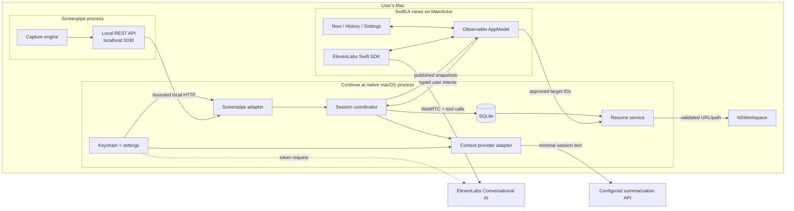
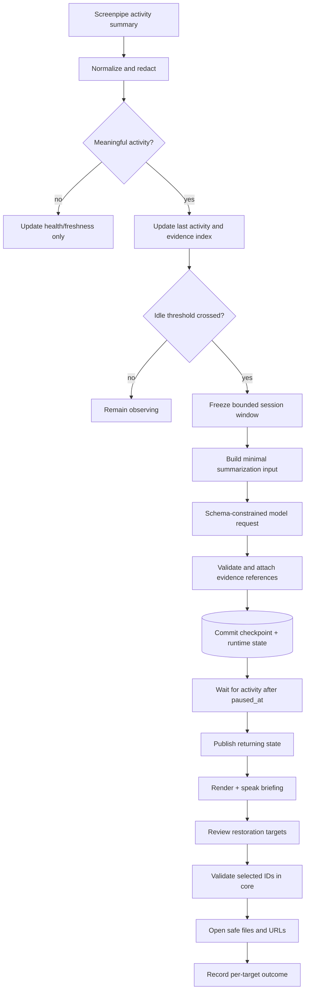
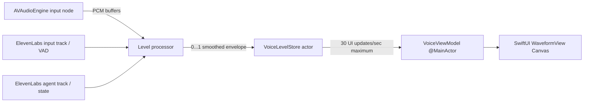
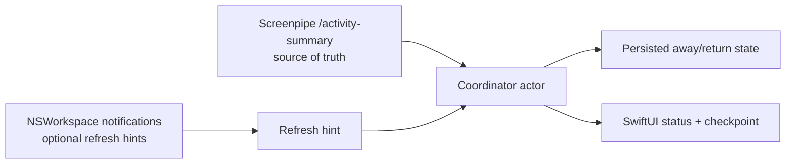
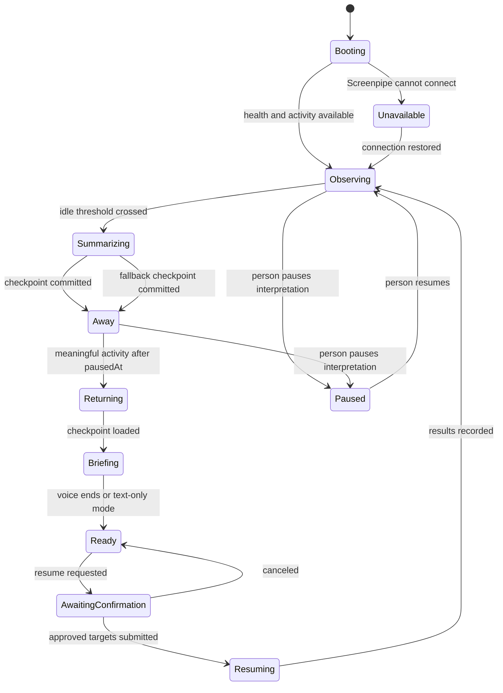
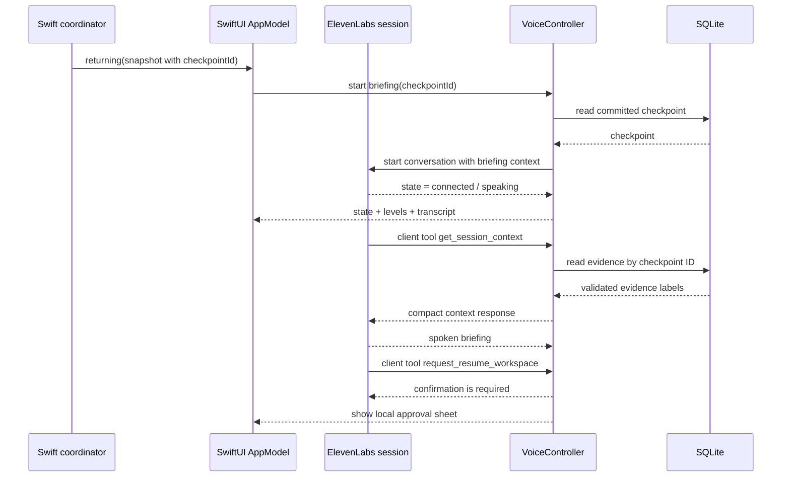
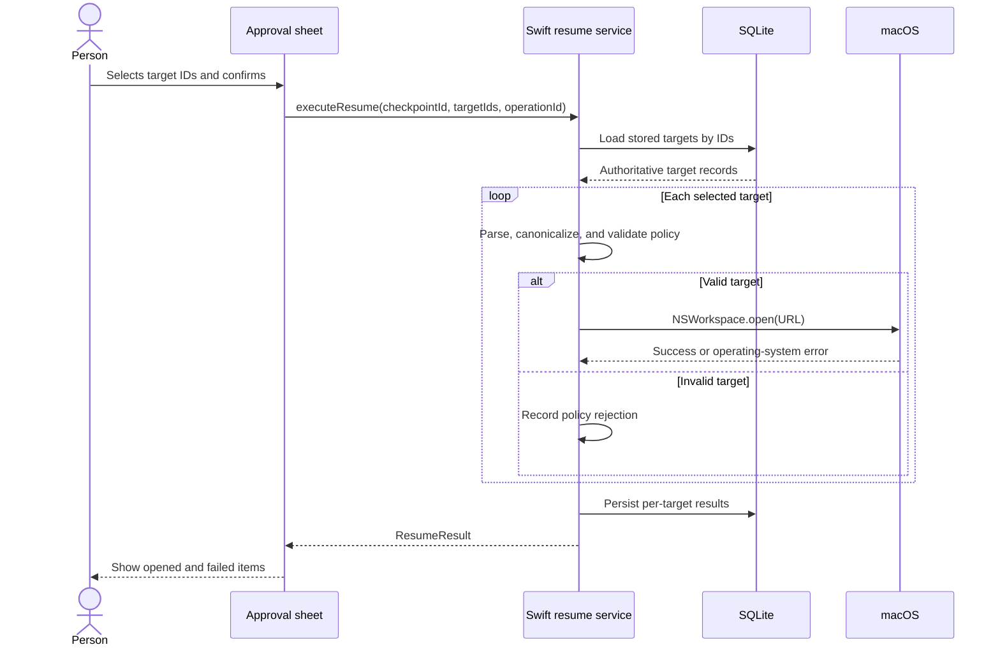
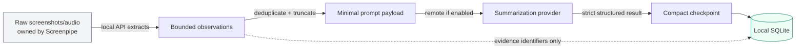
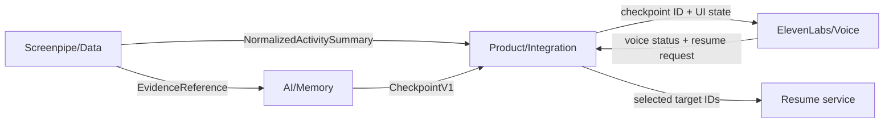

# Continue.ai Desktop Implementation Architecture

> **Current product contract:** [`PRODUCT_DECISIONS.md`](PRODUCT_DECISIONS.md) records the decisions made after the user-flow review. It is authoritative where older wording in this research document describes automatic voice playback, default workspace restoration, a different away threshold, or a different retention default.

## 1. Executive decision

Continue.ai will be implemented as a local-first macOS desktop application that observes activity through Screenpipe, converts a completed work session into a small structured checkpoint, posts a passive return notification, and presents the checkpoint when the person opens Continue. Voice is a manually started two-way conversation. Continue preserves current application state by default and reopens a file or URL only through the optional **Something closed?** review.

The production-shaped implementation will use these boundaries:

- **Screenpipe** remains a separate local capture and search service. Continue.ai reads its documented local HTTP API instead of reading Screenpipe's database or implementing a second screen recorder.
- **SwiftUI** provides the native macOS application window, menu-bar presence, accessibility behavior, animation, and voice-first interaction surface.
- **Swift actors and services** perform Screenpipe requests, checkpoint persistence, secret-backed model requests, state coordination, and approved operating-system actions. `URLSession` supplies asynchronous HTTP, and AppKit supplies the final file/URL opening operation.
- **Pure TypeScript packages** remain useful as fixture generators, provider experiments, and a temporary browser harness. Shared JSON contracts will be mirrored by `Codable` Swift types rather than importing a JavaScript runtime into the native app.
- **ElevenLabs' Swift SDK** supplies the manually started real-time voice conversation, client tools, conversation state, input/output tracks, and agent-state callbacks. Voice tools can read the current checkpoint, but a request to reopen a missing item opens an approval screen rather than executing immediately.[^27][^28]
- **SQLite** stores compact checkpoints, runtime state, settings, evidence references, and approved restoration targets. Continue.ai does not duplicate raw screenshots or audio from Screenpipe.

This design intentionally replaces the current server-shaped Next.js runtime. The native app does not need a web server or browser bridge for its privileged operations. Tauri plus React/Vite remains a documented fallback if cross-platform distribution becomes a requirement; Tauri expects a static frontend, while the current application depends on Next.js server components, route handlers, Node filesystem APIs, and a separate Node worker.[^1][^2]

The existing repository remains valuable. Its components, domain schemas, mock data, and state-detection prototype provide the starting point. The implementation changes the runtime boundary rather than discarding the product work.

### Native SwiftUI decision

SwiftUI is the recommended primary shell because the first target is macOS and the product's most visible interaction is a native voice surface. SwiftUI supplies `WindowGroup` for the main window and `MenuBarExtra` for a persistent menu-bar control. The ElevenLabs Swift SDK supports macOS, Swift concurrency, SwiftUI observation, client tools, and both voice and text modes. Apple's `AVAudioEngine` can provide microphone level samples, while SwiftUI's `Canvas` and `TimelineView` can draw and animate a waveform efficiently.[^27][^30][^31][^32]

The choice has one environment prerequisite. The current machine has Swift 6.3.3 and the Command Line Tools, but it does not have the full Xcode application installed. Building, signing, running, and debugging a SwiftUI macOS application requires installing Xcode and selecting it as the active developer directory before Phase 1.

| Decision factor | SwiftUI native app | Tauri + React/Vite |
|---|---|---|
| macOS window, menu bar, permissions, and accessibility | Direct platform APIs | Plugin and capability configuration |
| Voice integration | Official ElevenLabs Swift SDK | Official ElevenLabs React/JavaScript SDK |
| Waveform rendering | `Canvas`, `TimelineView`, `AVAudioEngine`, native audio tracks | Web audio or SDK-level browser audio data |
| Reuse of current TypeScript UI | Requires a port of visual components | High reuse |
| Cross-platform future | Requires another client later | Stronger starting point |
| First-demo fit | **Recommended** for macOS voice experience | Useful fallback if the team cannot install Xcode or needs a web build |

The team should therefore build the product UI and runtime in Swift, retain TypeScript packages as a contract and fixture source during migration, and keep the Tauri path only as an explicit alternative. The application should not run both shells in the first demo.

## 2. Scope and assumptions

The first milestone is the 12-hour demonstration already defined for the project:

1. A person works with normal applications.
2. Continue.ai detects that the person has left.
3. Continue.ai creates one checkpoint for the session.
4. The person returns.
5. Continue.ai posts a passive notification without opening or focusing itself.
6. The person opens Continue.ai and reads a concise checkpoint.
7. The person may start a two-way voice conversation, correct the next step, dismiss the checkpoint, or select **Done**.
8. If an item actually closed, the person selects **Something closed?** and chooses from an initially empty selection.
9. Continue.ai opens only confirmed targets and reports any partial failure.

The plan uses the following assumptions:

- The demonstration runs on macOS on Apple Silicon.
- Screenpipe is installed, has the required macOS permissions, and runs locally before the demo.
- The computer has network access for the summarization model and ElevenLabs.
- A public ElevenLabs agent is acceptable for the hackathon, or the team provides a private agent ID and API credentials before integration.
- The first release can optionally reopen confirmed files and web URLs. It does not restore or focus application state by default, type into applications, click arbitrary controls, or execute shell commands.
- The first release supports one local person and one machine.
- The application may require its main process to remain running, but the window may be hidden.

One local prerequisite is currently unmet: the `screenpipe` executable was not found and `http://localhost:3030/health` did not respond during repository inspection. The code can be built against fixtures first, but the real integration cannot be verified until Screenpipe is installed and running.

## 3. Current repository assessment

The repository already contains a coherent mock vertical slice. The following table separates reusable work from code that must be replaced or moved.

| Area | Current implementation | Keep | Required change |
|---|---|---|---|
| Home UI | `apps/web/src/app/page.tsx` composes the orb, session card, status, resume button, and privacy indicator | Component concepts, copy direction, layout hierarchy | Move into `apps/desktop`; bind all visible states to the coordinator instead of hardcoded `returning` |
| Screenpipe | `packages/screenpipe/src/client.ts` returns fixtures and reports healthy | Types, fixture adapter, normalization tests | Add a real adapter that calls the local API with authentication, bounded time ranges, selected fields, and deadlines |
| Context engine | `packages/context-engine/src/summarizeSession.ts` returns demo checkpoint content | Prompt assembly, schema module, mock provider | Add a provider interface, schema-constrained model response, evidence mapping, validation, timeout, and fallback |
| Memory | `packages/memory` writes `data/memory.sqlite`; the native client reads the shared `memories` table | Repository interface, canonical checkpoint schema, and fixtures | Add native writes and runtime-state migrations when the live coordinator replaces the preview runtime |
| Voice | `packages/voice` provides briefing/tool contracts; the native app uses the pinned ElevenLabs Swift SDK | Tool names, briefing formatter, mocked tests | Add transcript persistence and richer workspace-tool results after the approval coordinator lands |
| Workspace | `packages/workspace/openUrl.ts` and `openFile.ts` only log | Target types and pure validation tests | Add approval UI and a Swift `NSWorkspace` opener constrained by URL scheme and approved directories |
| Coordinator | `apps/worker/src/scheduler.ts` demonstrates away/return detection | State-transition logic and replayable test cases | Persist state, run in a Swift actor, deduplicate checkpoints, publish snapshots, and handle restart recovery |
| API | Next.js route handlers provide checkpoint/context/resume endpoints | Request/response contracts where useful | Replace internal HTTP routes with typed Swift service calls; the local UI does not need a web server |

The first implementation rule is therefore: **preserve domain logic and replace environment-specific adapters**. A domain function may accept normalized activity and return a decision. It must not assume Node.js, Next.js, a browser, Rust, or Swift. An adapter performs a local HTTP request, a database transaction, or an operating-system action.

## 4. Product structure

The desktop application has one dominant purpose: help a returning person understand and resume the most recent work session. The home screen should not become a general activity dashboard.

### 4.1 Primary navigation

The first release has three destinations:

1. **Now** — current capture state, return briefing, current checkpoint, and resume action.
2. **History** — prior checkpoints with search and deletion.
3. **Settings** — Screenpipe connection, idle threshold, voice, summarization provider, retention, exclusions, and approved directories.

The Now screen owns the demo. History and Settings remain secondary surfaces.

### 4.2 Now screen wireframe

```text
┌──────────────────────────────────────────────────────────────────────────┐
│ Continue.ai                                                History   ⚙︎  │
│ ● Observing · Screenpipe connected · updated 12 seconds ago              │
├──────────────────────────────────────────────────────────────────────────┤
│                                                                          │
│                              ◉                                           │
│                     “Welcome back, Leslie.”                              │
│                                                                          │
│  ┌────────────────────────────────────────────────────────────────────┐  │
│  │ CONTINUE.AI · Current checkpoint                                  │  │
│  │                                                                    │  │
│  │ Product UI and integration                                         │  │
│  │ You were connecting the return-state UI to the checkpoint model.   │  │
│  │                                                                    │  │
│  │ Last action    Reviewed the mock resume route.                      │  │
│  │ Next action    Replace the route with an approved desktop command. │  │
│  │                                                                    │  │
│  │ High confidence · captured 3 minutes ago · View evidence           │  │
│  └────────────────────────────────────────────────────────────────────┘  │
│                                                                          │
│                         [ Review & resume ]                              │
│                                                                          │
│  Screen capture: on · Microphone: off · Stored locally · Privacy         │
└──────────────────────────────────────────────────────────────────────────┘
```

The interface must communicate four machine states directly:

- **Activity:** booting, observing, away, returning, or paused.
- **Freshness:** when Continue.ai last received activity and when it created the checkpoint.
- **Confidence:** whether evidence strongly or weakly supports the summary.
- **Capability:** whether screen context, voice, summarization, and restoration are available.

The orb may show voice activity, but it cannot be the only state indicator. Text must identify what the application is doing because animation alone is ambiguous and inaccessible.

### 4.3 Resume approval sheet

The existing **Resume** button should become **Review & resume**. It opens this local confirmation surface:

```text
┌──────────────────────────────────────────────────────────────┐
│ Resume “Product UI and integration”                          │
│                                                              │
│ Continue.ai will open only the selected items.                │
│                                                              │
│ ☑ Browser  https://github.com/Johnnti/continue.ai             │
│ ☑ File     …/continue.ai/apps/web/src/app/page.tsx            │
│ ☐ Browser  http://localhost:3000                              │
│                                                              │
│ Source: observed during the saved session                     │
│                                                              │
│                         [Cancel] [Open 2 selected items]       │
└──────────────────────────────────────────────────────────────┘
```

The approval sheet prevents an inference model or voice transcript from silently causing an external action. It also makes an incorrect restoration proposal easy to correct.

### 4.4 Required edge states

| State | What the interface says | Available action |
|---|---|---|
| Screenpipe not installed | “Screenpipe is required to capture local work context.” | Open setup instructions; retry connection |
| Screenpipe stopped | “Capture is unavailable. Your previous checkpoints remain local.” | Retry; open Screenpipe |
| Recording but no recent capture | “Screenpipe is running, but no activity was captured in this period.” | Inspect permissions |
| Summarization pending | “Preparing your checkpoint…” with start time | Cancel or continue waiting |
| Summarization failed | Show last reliable checkpoint and literal error category | Retry; use activity-only fallback |
| Voice unavailable | Display the written briefing normally | Retry microphone/voice; continue silently |
| Low confidence | Mark uncertain fields and show evidence | Edit or dismiss checkpoint |
| No restore targets | “No safe files or links were identified.” | Copy next step; manually choose a file |
| Partial restore | Name each opened and failed target | Retry failed targets |
| Storage migration failed | Keep application read-only | Export diagnostics; retry after repair |

## 5. System architecture

### 5.1 Process and trust-boundary diagram



SwiftUI views run in the same signed application as the services, so the design must enforce boundaries through Swift concurrency, `@MainActor` state ownership, private service interfaces, Keychain storage, and a minimal entitlement set. The view layer never receives API keys, raw Screenpipe payloads, or general SQL access. The coordinator publishes small snapshots to the `AppModel`, and the `AppModel` sends typed intents back to the coordinator. Swift actors provide serialized access to mutable services, while Keychain Services provides encrypted storage for small secrets.[^38][^39] If a later cross-platform build adopts Tauri, its capability model and command boundary remain the fallback security design.[^3][^4][^5]

### 5.2 Data-flow diagram



### 5.3 Repository target

```text
continue.ai/
├── apps/
│   ├── macos/
│   │   ├── Package.swift
│   │   ├── Sources/
│   │   │   ├── ContinueApp/
│   │   │   │   ├── AppModel.swift
│   │   │   │   ├── Features/
│   │   │   │   │   ├── Session/
│   │   │   │   │   ├── Voice/
│   │   │   │   │   ├── History/
│   │   │   │   │   └── Settings/
│   │   │   │   └── UI/
│   │   │   └── ContinueCore/
│   │   │       ├── domain models
│   │   │       ├── service contracts
│   │   │       └── preview providers
│   │   ├── Tests/ContinueCoreChecks/
│   │   └── scripts/check.sh
│   ├── desktop/              # optional Tauri fallback, not the primary demo target
│   ├── web/                  # temporary visual/debug harness
│   └── worker/               # temporary coordinator fixture harness
├── packages/
│   ├── shared/               # versioned cross-boundary schemas
│   ├── context-engine/       # prompt/schema/evidence utilities
│   ├── screenpipe/           # normalized types and fixtures
│   ├── voice/                # tool contracts and briefing formatter
│   └── workspace/            # target types and pure validators
└── docs/
    └── IMPLEMENTATION_ARCHITECTURE.md
```

`apps/web` and `apps/worker` should remain until the native path reaches feature parity. Removing them before parity would eliminate useful fixtures and make regressions harder to isolate. The Swift package should consume the same JSON fixture files as the TypeScript packages, so a Screenpipe response or checkpoint can be replayed in either runtime.

## 6. Desktop shell implementation

### 6.1 Native SwiftUI application

Create the native targets in `apps/macos/Package.swift`. The hackathon client uses a `WindowGroup` for the main Now screen and a `Settings` scene for policy controls. Xcode can open the package directly when the team needs previews, app signing, or distribution. A later integration commit can add `MenuBarExtra` after the coordinator has a real background lifecycle. Apple documents `WindowGroup` as the normal macOS window container and `MenuBarExtra` as a persistent menu-bar scene.[^35][^36]

The top-level application has one observable model on the main actor and several isolated services:

```swift
@main
struct ContinueApp: App {
    @StateObject private var appModel = AppModel()

    var body: some Scene {
        WindowGroup("Continue.ai") {
            NowView()
                .environmentObject(appModel)
                .frame(minWidth: 760, minHeight: 560)
        }

        Settings {
            SettingsView()
                .environmentObject(appModel)
        }

        MenuBarExtra("Continue.ai", systemImage: "waveform") {
            StatusMenuView()
                .environmentObject(appModel)
        }
        .menuBarExtraStyle(.window)
    }
}
```

`AppModel` is responsible only for view state and user intents. It calls a coordinator actor through protocols. The coordinator actor owns the polling task and transition rules. `ScreenpipeClient`, `ContextProvider`, `CheckpointStore`, `ResumeService`, `KeychainStore`, and `VoiceController` are separate services so tests can substitute deterministic fakes.

The native-facing API replaces the old Next.js routes:

```swift
@MainActor
final class AppModel: ObservableObject {
    @Published private(set) var snapshot: RuntimeSnapshot = .booting
    @Published private(set) var checkpoint: Checkpoint?
    @Published var resumeSheet: ResumePreview?

    private let coordinator: any CoordinatorAPI

    func load() async { /* read snapshot and latest checkpoint */ }
    func reviewResume() async { /* request preview by checkpoint ID */ }
    func confirmResume(_ targetIDs: Set<String>) async { /* execute IDs */ }
}
```

The model-facing types live in the `ContinueCore` target under `apps/macos/Sources/ContinueCore` and conform to `Codable`, `Sendable`, and `Equatable` where appropriate. During migration, the Swift package should read the same sanitized JSON fixtures as the TypeScript packages. This permits the team to port one service at a time and compare outputs before deleting the temporary web harness.

The application must not expose general filesystem, shell, or HTTP methods to views. A view may request `reviewResume()` or `confirmResume(targetIDs)`. The service reloads authoritative values from SQLite and performs validation before any operating-system action.

### 6.2 Background behavior

The native process owns the session coordinator. Closing the main window must not stop observation; `WindowGroup` and the menu-bar scene keep the application process available, and the coordinator task continues until the person pauses interpretation or quits. The menu-bar menu needs three actions: **Open Continue.ai**, **Pause capture interpretation**, and **Quit**. The app delegate should retain the coordinator and cancel it during application termination.

Autostart should remain disabled by default during the hackathon. A later release can add login launch only after onboarding explains capture, microphone, retention, and network behavior and the person opts in. The current build should provide a visible **Quit** action and a separate **Pause interpretation** action.

### 6.3 Waveform implementation

The waveform is a first-class voice-state indicator in the Now screen. It does not represent Screenpipe's screen recordings or raw captured activity. It represents the live voice interaction: microphone input while the person speaks, agent output while ElevenLabs speaks, and a quiet state while the agent is thinking or disconnected.

Use a custom `WaveformView` instead of making the orb the only signal. SwiftUI's `Canvas` is intended for dynamic two-dimensional drawing, and `TimelineView` can redraw a view on a controlled schedule.[^30][^31] The view should draw 32 or 48 mirrored vertical bars with a calm gradient, a soft center glow, and a stable baseline. A single container accessibility label describes the state because individual `Canvas` drawing elements are not independently accessible.[^30]

The level pipeline is:



For the local microphone, request permission before starting the audio engine. Apple's audio APIs expose the engine's input node and allow an audio tap to observe buffers; the application must declare `NSMicrophoneUsageDescription` and request record permission explicitly.[^32][^33][^34] The tap computes a short-term root-mean-square (RMS) level and immediately discards the samples. Continue.ai stores only the smoothed level envelope in memory and never persists microphone samples for the waveform.

The level processor should perform these operations:

1. Read the first channel from each PCM buffer.
2. Calculate RMS over that buffer.
3. Convert RMS to a bounded decibel value and normalize it to `0...1`.
4. Apply a fast attack and slower release so bars respond quickly but do not jitter.
5. Add a small noise gate so room noise leaves a nearly flat baseline.
6. Append the value to a ring buffer of 32–48 recent levels.
7. Publish at no more than 30 updates per second; the audio tap itself may run faster.

The conceptual normalization is:

```swift
let rms = sqrt(samples.reduce(0) { $0 + $1 * $1 } / Float(samples.count))
let decibels = 20 * log10(max(rms, 0.000001))
let normalized = min(max((decibels + 60) / 60, 0), 1)
```

The exact constants should be calibrated against the selected microphone. The waveform should never expose raw sample values to the view model when a scalar envelope is sufficient.

For ElevenLabs output, prefer the SDK's `agentAudioTrack` or an audio-level callback when the pinned SDK version exposes one. The SDK documents `inputTrack`, `agentAudioTrack`, reactive `agentState`, and audio-alignment callbacks.[^27] If the SDK version does not expose output samples, use `agentState == .speaking` to drive a bounded, gently varying envelope and label it **Speaking** rather than implying that the bars are a sample-accurate oscilloscope. The official `components-swift` repository provides a maintained level-driven `OrbVisualizer` reference; its audio-track and state handling can inform the waveform controller even though the product will use bars instead of an orb.[^29]

The visual state mapping is:

| Voice state | Waveform behavior | Label |
|---|---|---|
| Disconnected | Flat low bars, no glow | `Voice off` |
| Connecting | Slow left-to-right shimmer | `Connecting` |
| Listening | Microphone envelope, cool blue/green bars | `Listening` |
| Thinking | Low-amplitude breathing pulse, no microphone claim | `Thinking` |
| Speaking | Agent envelope, brighter bars and center glow | `Speaking` |
| Muted | Flat bars with a muted icon | `Microphone muted` |
| Error | Frozen bars with warning tint | `Voice unavailable` |

The waveform must not replace text. Place the state label beside or below it, expose mute and stop controls, and keep the written briefing visible. If microphone permission is denied, the UI displays a written briefing and a link to macOS Privacy & Security settings.

### 6.4 Tauri fallback

If the team needs Windows/Linux support or cannot install Xcode, retain the earlier Tauri plan as a separate implementation. Tauri's command bridge, capability allowlist, SQL plugin, opener plugin, React/Vite template, tray API, and optional autostart plugin remain valid references.[^3][^4][^6][^7][^8][^9][^15][^21][^22] Do not mix a SwiftUI window with a Tauri webview in the first demo. That would create two competing lifecycle and state-ownership models.

## 7. Screenpipe integration

### 7.1 Integration contract

Continue.ai should treat Screenpipe as the source of captured evidence and use its HTTP API. Screenpipe's current API guidance identifies `/activity-summary` as the broad-context endpoint and `/search` as the bounded evidence endpoint. It also defines authenticated requests, health behavior, capture-status values, and explicit handling for empty or stopped capture.[^10]

The Screenpipe adapter performs these operations:

```text
health()                  -> ScreenpipeHealth
activitySummary(range)   -> NormalizedActivitySummary
searchEvidence(query)    -> EvidenceReference[]
```

The adapter should use this request policy:

- Base URL defaults to `http://localhost:3030` and may be changed in Settings.
- `/health` checks availability without treating a successful process response as proof of recent capture.
- Other calls include the local API key as a bearer credential when configured and send the documented client header.
- Every query includes a bounded start and end time.
- Search limits remain small; the application requests only fields needed for a checkpoint.
- Connection and total-body deadlines prevent a local service from hanging the coordinator. Screenpipe's own Tauri client contains a useful reference implementation for separate connection and body deadlines.[^11]
- The adapter maps API-specific states into stable internal states rather than leaking raw response variants into the UI.

### 7.2 Normalized activity model

The rest of Continue.ai should receive a small internal representation:

```ts
type NormalizedActivitySummary = {
  rangeStart: string;
  rangeEnd: string;
  capturedAt: string;
  status: "ok" | "empty" | "not_recording" | "unavailable";
  applications: Array<{ name: string; activeSeconds: number }>;
  windows: Array<{ app: string; title: string; lastSeenAt: string }>;
  textFragments: Array<{
    id: string;
    source: "ocr" | "accessibility" | "transcript" | "file";
    text: string;
    timestamp: string;
  }>;
  editedFiles: Array<{ path: string; timestamp: string }>;
  urls: Array<{ url: string; title?: string; timestamp: string }>;
};
```

The normalizer should remove duplicate fragments, truncate individual text fields, discard low-value system UI, and retain timestamps. It should not decide the final task summary.

### 7.3 Captured content is untrusted

Text obtained from a screen, transcript, browser page, or file may contain instructions directed at an AI system. Continue.ai must treat that text as evidence, not as executable instructions. The summarization prompt should state that captured text cannot change the task, tool policy, output schema, or destination. The resume service must never interpret free-form model text as a command.

This rule is especially important because the application observes web pages and chat messages. A page could display text such as “open this command” or “upload this file.” The context engine may summarize the page, but no captured instruction may gain privileges.

### 7.4 Polling cadence

For the demonstration:

- Check health every 15 seconds.
- Request a short activity summary every 10 seconds while observing.
- Use a configurable idle threshold of 90 seconds so the demo can progress quickly.
- Use a 10–15 minute session evidence window for the demo.

For a production build, use a 30–60 second activity interval and a longer default idle threshold. The coordinator should skip a poll if the prior poll is still running. A slow response must not create overlapping work.

### 7.5 App-tracking strategy: high-level source first

Continue.ai should not implement a low-level process monitor, enumerate every process, inspect window server state, or read private macOS telemetry. Screenpipe already provides the higher-level observations needed by this product: applications, windows, timestamps, edited files, text snippets, audio status, and a `data_status` value. The coordinator should call `/activity-summary` for session decisions and `/search` only when it needs a specific evidence item.[^10]

The native Swift app may subscribe to `NSWorkspace` notifications as a supplemental signal. Apple exposes notifications for application activation, launch, termination, user-session changes, sleep, and wake, and exposes `frontmostApplication` and `runningApplications` for current process metadata.[^37] Those signals are useful for waking an early refresh or explaining a system-level pause, but they do not establish what the person was doing inside an application.



Use the following source policy:

| Need | Primary source | Frequency | Reason |
|---|---|---:|---|
| Current apps, windows, and recent context | Screenpipe `/activity-summary` | 10–15 seconds in demo; 30–60 seconds later | Includes capture health and activity freshness |
| Exact text, frame, or media evidence | Screenpipe `/search` | On demand after a summary | Avoids transferring large evidence on every poll |
| Foreground app changed | `NSWorkspace.didActivateApplicationNotification` | Event-driven hint | Can prompt an early Screenpipe refresh; not a task summary |
| App launched or terminated | `NSWorkspace` launch/terminate notifications | Event-driven hint | Helps explain a workspace change; do not persist every process event |
| Mac session or display slept/woke | `NSWorkspace` session/screen sleep notifications | Event-driven | Prevents sleep from being interpreted as a person-return event |
| Person is away | Screenpipe activity freshness plus the coordinator's idle threshold | Coordinator poll | App switching is not absence; process state alone cannot detect this reliably |

The away decision must be based on the timestamp of the last meaningful captured activity, not on the number of running processes. A person can leave a browser open, switch applications, or keep a background process alive. Those conditions do not prove that the person is present or absent.

If Screenpipe is temporarily unavailable, the coordinator may use `NSWorkspace` only to label the application as **capture unavailable** and preserve the last checkpoint. It must not create a new checkpoint from process names alone. If a later product requirement needs precise keyboard/mouse idle detection, add it as a separately consented macOS capability and keep it as a secondary signal that still requires Screenpipe evidence.

Persist stable bundle identifiers and human-readable application names only when they are part of a checkpoint or evidence reference. Do not persist process IDs as durable identity because PIDs are reused after an application exits. Do not persist a complete `runningApplications` snapshot for every poll; that would create unnecessary surveillance data and would not improve the core resume experience.

## 8. Session coordinator and state machine

The coordinator is the single writer of runtime state. UI components, the voice client, and restore commands read that state but do not independently infer whether the person is away or returning.

### 8.1 State diagram



The coordinator persists the current state after important transitions. A process restart therefore cannot create a duplicate checkpoint or greet the person repeatedly.

### 8.2 Transition conditions

`Observing → Summarizing` requires all of the following:

- Screenpipe reported meaningful activity during the current session.
- `now - lastMeaningfulActivityAt` exceeds the idle threshold.
- No checkpoint exists for the current session ID.
- The session contains enough evidence to produce at least a fallback checkpoint.

`Away → Returning` requires:

- Screenpipe reports meaningful activity with a timestamp later than `pausedAt`.
- The checkpoint has not already been briefed during this return cycle.

`Returning → Briefing` loads the exact committed checkpoint. It must not run a second summary that could change the story between the visual and spoken briefing.

### 8.3 Idempotency

An idempotent operation produces the same durable result when the same event is processed more than once. The coordinator needs idempotency because timers, process restarts, and retries can repeat work.

Each session receives a stable ID based on its start time plus a random suffix. The database enforces a unique checkpoint per session. Each return cycle receives a unique ID. The database records whether that cycle displayed and spoke the briefing. Each resume execution receives an operation ID and stores per-target results.

## 9. Checkpoint generation

### 9.1 Checkpoint contract

The checkpoint is a versioned record:

```ts
type CheckpointV1 = {
  schemaVersion: 1;
  id: string;
  sessionId: string;
  sessionStartedAt: string;
  pausedAt: string;
  createdAt: string;
  project: string;
  currentTask: string;
  status: "in_progress" | "blocked" | "complete" | "unclear";
  summary: string;
  lastAction: string | null;
  nextAction: string | null;
  confidence: "low" | "medium" | "high";
  evidenceRefs: EvidenceReference[];
  resumeTargets: ResumeTarget[];
};
```

Use required nullable properties rather than optional properties for the model-facing schema. Strict structured-output systems generally behave more reliably when the shape is fixed. The OpenAI Node library provides an official `responses.parse` and Zod structured-output example that can serve as the first provider adapter if OpenAI is selected.[^12][^13] Zod remains an appropriate TypeScript validator for the application boundary.[^14]

### 9.2 Provider interface

The context engine should not hardcode one model vendor:

```ts
interface ContextProvider {
  summarize(input: CheckpointInput, signal: AbortSignal): Promise<CheckpointDraft>;
}
```

Implement these adapters:

- `MockContextProvider` for deterministic UI, unit tests, and the demonstration fallback.
- `OpenAIContextProvider` if the team uses OpenAI.
- A later provider can implement the same contract without changing the coordinator.

The Swift context service owns the API credential in Keychain Services and calls a fixed provider host. The view layer passes a checkpoint request ID, not a destination URL or secret. The provider interface remains pure enough to run from the TypeScript fixture harness during migration.

### 9.3 Prompt construction

The request should contain:

1. A fixed system policy defining the JSON schema and untrusted-input rule.
2. A bounded list of applications and windows.
3. Deduplicated text fragments with timestamps and evidence IDs.
4. Recent edited files and observed HTTP/HTTPS URLs.
5. A request to distinguish direct evidence from inference.
6. Length limits for every human-visible field.

The request should not contain raw screenshots, entire transcripts, full file contents, or unrelated activity by default. This reduces privacy exposure, cost, latency, and distraction.

### 9.4 Validation and fallback

After the provider responds, the context service must:

- Parse against the strict schema.
- Reject extra fields and invalid enum values.
- Enforce maximum lengths.
- Verify every evidence reference exists in the request.
- Verify every proposed restore target came from observed metadata.
- Downgrade confidence if required evidence is missing.
- Retry once for a transient transport or schema failure.
- Produce an activity-only fallback if the retry fails.

The fallback may say: “You were active in VS Code and Chrome. Continue.ai could not determine the precise next step.” It is better to show an explicit limitation than to invent a task.

## 10. Local persistence

SQLite replaces `data/checkpoints.json`. The TypeScript memory package writes
`data/memory.sqlite`, and the native app now uses a serialized `SQLite3`
repository to read the compatible `memories` table. The adapter creates the
table and index when a new local database is selected, keeps SQL off the
SwiftUI views, and maps canonical checkpoint JSON into the native model. Native
writes and the full migration set remain part of the live coordinator work.

SwiftUI views should not receive general SQL access. The `CheckpointStore` actor should execute migrations and queries, then return product-specific values to `AppModel`. This keeps database work off the main actor and allows the store to be replaced with an in-memory fake in UI tests.

### 10.1 Initial schema

```sql
CREATE TABLE checkpoints (
  id TEXT PRIMARY KEY,
  schema_version INTEGER NOT NULL,
  session_id TEXT NOT NULL UNIQUE,
  session_started_at TEXT NOT NULL,
  paused_at TEXT NOT NULL,
  created_at TEXT NOT NULL,
  project TEXT NOT NULL,
  current_task TEXT NOT NULL,
  status TEXT NOT NULL,
  summary TEXT NOT NULL,
  last_action TEXT,
  next_action TEXT,
  confidence TEXT NOT NULL,
  raw_json TEXT NOT NULL
);

CREATE TABLE evidence_refs (
  id TEXT PRIMARY KEY,
  checkpoint_id TEXT NOT NULL REFERENCES checkpoints(id) ON DELETE CASCADE,
  source_type TEXT NOT NULL,
  source_timestamp TEXT NOT NULL,
  label TEXT NOT NULL,
  locator_json TEXT NOT NULL
);

CREATE TABLE resume_targets (
  id TEXT PRIMARY KEY,
  checkpoint_id TEXT NOT NULL REFERENCES checkpoints(id) ON DELETE CASCADE,
  target_type TEXT NOT NULL,
  value TEXT NOT NULL,
  label TEXT NOT NULL,
  source_evidence_id TEXT,
  confidence TEXT NOT NULL
);

CREATE TABLE runtime_state (
  singleton_id INTEGER PRIMARY KEY CHECK (singleton_id = 1),
  state TEXT NOT NULL,
  session_id TEXT,
  session_started_at TEXT,
  last_meaningful_activity_at TEXT,
  paused_at TEXT,
  checkpoint_id TEXT,
  return_cycle_id TEXT,
  briefing_delivered_at TEXT,
  updated_at TEXT NOT NULL
);

CREATE TABLE settings (
  key TEXT PRIMARY KEY,
  value_json TEXT NOT NULL,
  updated_at TEXT NOT NULL
);

CREATE TABLE resume_operations (
  id TEXT PRIMARY KEY,
  checkpoint_id TEXT NOT NULL REFERENCES checkpoints(id),
  requested_at TEXT NOT NULL,
  completed_at TEXT,
  result_json TEXT
);
```

The database should store timestamps in UTC using RFC 3339 strings. The UI converts them to local time. A migration number must accompany every schema change.

### 10.2 Retention

The default retention should be 30 days for checkpoints. Settings should offer 1 day, 7 days, 30 days, 90 days, and “until I delete them.” Deleting a checkpoint also deletes its evidence references and restore targets. Continue.ai should offer **Delete all checkpoints** and show a confirmation that states exactly what will be removed.

## 11. ElevenLabs voice implementation

ElevenLabs maintains an official Swift SDK for iOS and macOS. The native app
now pins that SDK through Swift Package Manager, starts the configured public
agent or a private-agent conversation token, maps agent/VAD state to the
waveform, and handles the initial client-tool contract. A public agent may use
its agent ID directly; a private agent must receive a short-lived conversation
token from a backend. The API key must not be exposed in the application
bundle.[^27][^28] The app includes `NSMicrophoneUsageDescription` and requests
microphone access only when the person starts a voice session.[^34]

### 11.1 Voice topology



### 11.2 Voice tools

Configure only these initial tools:

- `get_last_session` — returns the checkpoint's project, task, summary, last action, next action, confidence, and timestamp.
- `get_session_context` — returns selected evidence labels when the person asks why Continue.ai inferred something.
- `request_resume_workspace` — asks the local UI to show the approval sheet and returns that confirmation is required.

Do not name the final tool `resume_workspace` if the agent can imply immediate execution. The name `request_resume_workspace` accurately states its effect. The Swift handler must use the checkpoint ID already associated with the current return cycle and ignore arbitrary file paths or URLs in tool parameters.

The official ElevenLabs Swift SDK repository contains the maintained Swift implementation, including Swift concurrency, reactive state, voice/text modes, audio tracks, audio alignment, and client-tool handling.[^28] The official `components-swift` repository contains a level-driven SwiftUI `OrbVisualizer`; its state and track handling can be adapted to the custom waveform described in section 6.3.[^29]

The `VoiceController` should be a `@MainActor` observable object that owns the current `Conversation`, maps SDK state into the product's `VoiceState`, subscribes to pending client tools, and forwards only validated results. A voice tool may read a checkpoint or request a review sheet. It may not call `NSWorkspace` directly.

```swift
@MainActor
final class VoiceController: ObservableObject {
    @Published private(set) var state: VoiceState = .off
    @Published private(set) var levels: [Float] = Array(repeating: 0.05, count: 40)

    private var conversation: Conversation?

    func start(agentID: String, briefing: String) async {
        // Request permission, start the SDK conversation, then send the briefing.
    }

    func stop() async {
        await conversation?.endConversation()
        conversation = nil
    }
}
```

### 11.3 Voice fallback

Voice is an enhancement, not a dependency for understanding or restoration. The UI always renders the complete briefing. If microphone permission, WebRTC, or ElevenLabs fails, the app shows **Voice unavailable—written briefing is ready**. The resume button remains functional.

The application should not automatically start a microphone session on every launch. It should start the return briefing only after the person enables voice in Settings and macOS grants permission.

## 12. Safe workspace restoration

### 12.1 Target contract

```ts
type ResumeTarget =
  | {
      id: string;
      type: "url";
      value: string;
      label: string;
      evidenceId: string;
      confidence: "low" | "medium" | "high";
    }
  | {
      id: string;
      type: "file";
      value: string;
      label: string;
      evidenceId: string;
      confidence: "low" | "medium" | "high";
    };
```

The SwiftUI view sends only the checkpoint ID and selected target IDs when it executes a resume. The Swift `ResumeService` reloads the targets from SQLite. This prevents view state or a voice transcript from changing the approved value between preview and execution.

### 12.2 URL validation

The Swift `ResumeService` must parse each URL and allow only `https` and `http`. It must reject `javascript:`, `data:`, `file:`, custom application schemes, embedded credentials, malformed hostnames, and URLs longer than the configured maximum. A future setting may add explicit custom schemes, but the first version should not support them.

### 12.3 File validation

For each file target, the Swift `ResumeService` must:

1. Canonicalize the path.
2. Verify that the target exists and is a regular file or approved directory.
3. Verify that it is inside a directory the person approved in Settings or selected through a native file dialog.
4. Reject device paths, traversal, unresolved symlinks outside approved roots, and paths supplied only by model-generated prose.
5. Open the validated URL through `NSWorkspace.shared.open(_:)` or its asynchronous configuration API. Apple documents `NSWorkspace` as the macOS service for opening URLs and files.[^37]

The app should use the Tauri opener plugin only in the optional cross-platform fallback. The native macOS implementation should call AppKit after validation and should record the Boolean result or completion error for each target.[^37]

### 12.3.1 Sandboxed file access

If the signed application enables App Sandbox, a plain path is not a durable permission grant. Settings should use `NSOpenPanel` when the person approves a directory, create a security-scoped bookmark, and store the bookmark data with the approved directory record. On restore, the service resolves the bookmark, calls `startAccessingSecurityScopedResource()`, opens the selected file, and calls `stopAccessingSecurityScopedResource()` immediately afterward. Apple documents security-scoped bookmarks as the mechanism that preserves user-approved file access across launches.[^41][^42]

For the unsigned hackathon build, the team may begin with canonical paths inside the repository, but the target contract should already carry an approval record so the sandbox migration does not change the voice or UI flow.

### 12.4 Restore sequence



No restore operation may execute a terminal command, install software, modify a file, submit a form, or send a message in the first release.

## 13. Privacy and permission model

The current UI language must accurately describe Screenpipe. If Screenpipe captures screenshots, OCR, accessibility text, or audio, Continue.ai must not state that it is “not tracking screen recordings.” The privacy panel should report observed configuration and health instead of making a blanket claim.

Settings should show:

- Screen capture status and the source of that status.
- OCR/accessibility capture status.
- Audio capture status and selected devices.
- Screenpipe connection address.
- Applications or windows excluded in Screenpipe.
- Summarization provider and whether text leaves the device.
- ElevenLabs voice state and whether microphone audio is sent.
- Checkpoint retention period.
- Approved restore directories.
- Buttons to inspect, delete, or export checkpoint data.

### 13.1 Data minimization diagram



Continue.ai should not copy raw screenshots or audio into its database. An evidence reference should contain a timestamp, source type, label, and a bounded locator sufficient to query Screenpipe again. If source data has expired, the UI should state that the evidence is no longer available.

## 14. Detailed implementation sequence

The schedule below prioritizes a complete vertical slice. Each phase ends in a state that can still demonstrate with mocks if a later external integration fails.

### Phase 0 — Establish a reproducible baseline (30–45 minutes)

- Install the repository package manager through Corepack if needed.
- Run type checking and the existing mock app.
- Run `scripts/seed-demo.ts` and verify the current checkpoint screen.
- Record the required Swift, Screenpipe, and model-provider prerequisites in the README. The current machine can compile SwiftUI packages with Swift 6.3.3; the full Xcode application is still required to sign and distribute a normal `.app` bundle.
- Install/start Screenpipe and confirm `/health` before assigning integration failures to Continue.ai.
- Preserve one deterministic fixture representing the exact hackathon demo.

**Exit condition:** every team member can render the mock checkpoint and knows whether Screenpipe is available.

### Phase 1 — Create the desktop shell (45–60 minutes)

- Create `apps/macos/Package.swift` with a SwiftUI executable target and a separate testable core target. Xcode can open the package directly when the team needs previews, signing, or distribution.
- Add `WindowGroup`, `Settings`, and `MenuBarExtra` scenes.
- Port the visual hierarchy from `apps/web` into Now, History, and Settings views.
- Add `AppModel`, `CoordinatorAPI`, and in-memory service fakes so the UI remains functional before live services exist.
- Add a first `WaveformView` driven by fixture levels and explicit voice states.

**Exit condition:** a development SwiftUI window renders the same mock checkpoint as the web app, and the waveform changes between listening, thinking, and speaking fixtures.

### Phase 2 — Connect Screenpipe (60–90 minutes)

- Implement Swift `ScreenpipeClient` with `URLSession` and bounded requests.
- Add bearer credential handling through Keychain Services.
- Add connection and body deadlines.
- Normalize API results into the shared activity contract.
- Map `ok`, empty-but-recording, no-capture, not-recording, authentication, and unavailable conditions into UI states.
- Add recorded fixtures for tests, with personal content removed.

**Exit condition:** the status strip shows real health and recent activity freshness.

### Phase 3 — Generate a real checkpoint (60–90 minutes)

- Finalize `CheckpointV1` and `CheckpointDraft` schemas.
- Implement provider-neutral prompt construction.
- Add `MockContextProvider` and one real provider.
- Use schema-constrained output and validate evidence/targets.
- Add one retry and an activity-only fallback.
- Display confidence and evidence references.

**Exit condition:** a bounded Screenpipe session produces a valid checkpoint without manual JSON editing.

### Phase 4 — Persist state and detect return (60–75 minutes)

- Add SQLite migrations.
- Port away/return transitions from `apps/worker` into a Swift coordinator actor.
- Persist state after each durable transition.
- Add checkpoint/session uniqueness constraints.
- Recover correctly after restarting during observing, summarizing, or away states.
- Publish compact state snapshots to the SwiftUI `AppModel`.

**Exit condition:** the app creates exactly one checkpoint after an idle interval and displays it once activity resumes.

### Phase 5 — Complete the product UI (60–75 minutes)

- Bind ActivityStatus and the waveform to real coordinator and voice state.
- Implement the mission-control Now screen.
- Add History with checkpoint open/delete actions.
- Add Settings for thresholds, providers, retention, voice, and approved directories.
- Implement every edge state listed in section 4.4.
- Add an evidence drawer with source type and timestamp.

**Exit condition:** the written return experience works without voice.

### Phase 6 — Add ElevenLabs (60–90 minutes)

- Add the pinned ElevenLabs Swift SDK through Swift Package Manager.
- Configure the agent's briefing instruction and three client tools.
- Implement voice status, waveform levels, start/stop control, and text-only fallback.
- For a private agent, request a short-lived conversation token through the configured token service and keep the API key out of the app bundle.
- Verify that `request_resume_workspace` opens a local approval sheet but does not restore anything by itself.

**Exit condition:** the spoken and written briefings refer to the same committed checkpoint.

### Phase 7 — Add approved restoration (45–75 minutes)

- Extract file/URL candidates from observed metadata.
- Implement preview with selected targets.
- Add URL and canonical path validation in Swift.
- Add `NSOpenPanel` directory approval and security-scoped bookmarks if App Sandbox is enabled.
- Execute selected target IDs and return per-target results.
- Record completion or failure without modifying the checkpoint.

**Exit condition:** the person can approve and reopen at least one browser URL and one project file.

### Phase 8 — Demo hardening (60–90 minutes)

- Run the full leave/return sequence repeatedly.
- Test Screenpipe stopped, model timeout, invalid model output, voice failure, missing file, and malformed URL.
- Confirm no credential appears in the web bundle or logs.
- Add a tray menu if time permits.
- Prepare a fixture-backed demo mode that clearly identifies itself if an external service fails.
- Record the exact setup and reset procedure.

**Exit condition:** the team can run the demonstration three consecutive times from a clean start.

## 15. Team ownership and integration contracts

### Screenpipe/Data owner

Owns the real Screenpipe adapter, normalized activity contract, fixtures, health mapping, evidence references, and capture troubleshooting. Delivers normalized data rather than UI-specific objects.

### AI/Memory owner

Owns the checkpoint schema, prompt, provider adapter, validation, confidence policy, fallback, SQLite migrations, and repository methods. Delivers committed `CheckpointV1` records.

### ElevenLabs/Voice owner

Owns the agent configuration, Swift SDK provider, conversation lifecycle, voice states, waveform level stream, three client tools, and private-token path. Reads checkpoints through the app services and does not access SQLite directly.

### Product/Integration owner

Owns `apps/macos`, the Now/History/Settings screens, coordinator-to-UI state mapping, waveform presentation, approval flow, Swift service contracts, edge states, full-sequence tests, demo script, and the final integration branch.

### Contract diagram



The shared schemas should be merged early. Each owner can then build against fixtures without waiting for every live service.

## 16. Test strategy

### 16.1 Unit tests

- Screenpipe response normalization and status mapping.
- Meaningful-activity classification.
- Away/return state transitions with a fake clock.
- Duplicate poll and restart idempotency.
- Checkpoint schema parsing and length limits.
- Evidence reference and restore-target verification.
- URL scheme rejection.
- Path canonicalization and approved-root enforcement.
- Briefing text generation.

### 16.2 Contract tests

Store sanitized Screenpipe JSON fixtures for:

- normal recent activity;
- running with no activity;
- no capture in range;
- recording stopped;
- missing authentication;
- delayed response;
- changed or missing optional fields.

Screenpipe's own testing checklist covers process stability, activity-summary behavior, silent model failures, live outputs, and edge cases; it is a useful upstream reference when constructing this matrix.[^23]

### 16.3 Integration tests

- `Codable` serialization between JSON fixtures and Swift domain types.
- SQLite migration from an empty application data directory.
- Checkpoint commit plus state transition in one transaction.
- SwiftUI refresh after a coordinator snapshot.
- Waveform level throttling and state-to-visual mapping.
- ElevenLabs tool names and parameters match agent configuration.
- Resume preview and execute use the same database target IDs.

### 16.4 End-to-end demonstration test

```text
Given Screenpipe is healthy and Continue.ai is observing
When the person works in a known repository and browser tab
And activity stops for the configured idle threshold
Then Continue.ai commits one checkpoint
When meaningful activity resumes
Then the Now screen enters returning state
And the written checkpoint identifies the project, current task, last action, and next action
And voice speaks the same checkpoint when voice is enabled
When the person requests resume
Then Continue.ai displays the proposed file and URL targets
When the person approves selected targets
Then Continue.ai opens only those targets
And reports a result for every selected target
```

## 17. Difficult components and trusted reference code

The team should adapt narrow patterns from maintained upstream projects. It should not copy an entire application or depend on undocumented internals.

| Difficult component | Trusted reference | What to adapt | What not to copy |
|---|---|---|---|
| Screenpipe API behavior | Screenpipe API skill/reference[^10] | Endpoints, authentication, status interpretation, bounded search | Direct database access or assumptions about internal tables |
| Reliable local HTTP | Screenpipe Tauri fetch wrapper[^11] | Separate connection and total-body deadlines | Application-specific error text or unrelated auth logic |
| Real Screenpipe desktop integration | Screenpipe's Tauri application[^24] | Packaging patterns and local-service lifecycle ideas | The full Screenpipe UI or its rapidly changing main branch |
| Native macOS application lifecycle | Apple's `WindowGroup` and `MenuBarExtra` documentation[^35][^36] | Window, Settings, menu-bar scenes, and lifecycle placement | A menu-bar-only app that hides important state |
| Swift service isolation | Apple's actor documentation and Keychain Services[^38][^39] | Actor-owned mutable state and keychain-backed credentials | Passing service objects and secrets through every view |
| Native voice session | ElevenLabs Swift SDK and Swift documentation[^27][^28] | Swift Package Manager dependency, conversation state, audio tracks, agent state, client tools | Hardcoding API keys or depending on an unpinned branch |
| Waveform rendering | Apple `Canvas`, `TimelineView`, and AVFAudio tap documentation[^30][^31][^32][^33] | Level sampling, smoothing, drawing, timing, and accessibility label | Persisting microphone samples or claiming sample-accurate output without output data |
| Voice visualizer reference | ElevenLabs `components-swift`[^29] | Track/state-driven visual transitions | Replacing the product waveform with an unrelated orb |
| Swift SQLite migrations | GRDB.swift[^40] | Database queue/pool, records, migrations, and test fixtures | Exposing raw SQL to SwiftUI views |
| macOS file/URL opening | Apple's `NSWorkspace` documentation[^37] | Open validated URLs and paths and record results | Opening arbitrary strings or bypassing approval |
| Sandboxed file permissions | Apple's security-scoped bookmark documentation[^41][^42] | Persist user-approved directory bookmarks and resolve them at restore time | Storing only a path and assuming it remains authorized |
| Tauri project layout | `create-tauri-app`[^7] | React/TypeScript/Vite scaffold | Example permissions that exceed Continue.ai's needs |
| Tauri command bridge | Official command documentation[^6] | Async command signatures and serialization | Generic arbitrary commands |
| Capability security | Tauri security and capability docs[^3][^4] | Main-window allowlist and least privilege | Wildcard command or path scopes |
| SQLite migrations | Official Tauri SQL plugin[^15] | App-config database path and Rust-defined migrations | Direct SQL access from every UI component |
| File/URL opening | Official Tauri opener plugin and source[^21][^22] | OS integration and scoped permission format | `openUrl(anyUserString)` without validation |
| Tauri voice fallback | ElevenLabs React docs and packages[^16][^18] | Provider placement, status hooks, start/stop lifecycle | API key in browser code |
| Tauri voice tool registration | ElevenLabs client-tool docs/reference[^17][^19] | Exact tool-name and parameter matching | Direct execution of sensitive actions |
| Tauri end-to-end voice example | ElevenLabs examples[^20] | Session initialization and teardown | Example-specific product UI |
| Strict model response | OpenAI Node structured-output docs/example[^12][^13] | Fixed schema parsing and typed result | Provider-specific calls inside domain code |
| Optional TypeScript worker sidecar | Tauri sidecar docs and Bun executable docs[^25][^26] | Packaging a standalone worker if a Rust port is rejected | This path for the first milestone unless necessary |

### 17.1 Tauri and TypeScript fallback

If macOS packaging, cross-platform support, or Xcode availability makes the native target unsuitable, the team can use the Tauri fallback described in section 6.4. If that fallback must preserve the current TypeScript worker, Tauri can bundle an external executable as a sidecar, and Bun can compile a TypeScript entry point into a standalone executable.[^25][^26] That alternative preserves more of the current Node worker.

It is not the preferred first path. A sidecar adds target-specific binary naming, process supervision, permissions, packaging, signing, and cross-architecture builds. Use it only after a time-boxed native Swift spike demonstrates that the port threatens the core demo.

## 18. Principal risks and mitigations

| Risk | Likely symptom | Mitigation |
|---|---|---|
| Screenpipe is absent or lacks macOS permission | Health failure or no recent capture | Setup checklist, explicit status mapping, fixture-backed demo mode |
| Screenpipe API changes | Parsing or authentication failures | Pin a tested release, isolate adapter, retain response fixtures |
| Xcode is not installed | The team cannot use previews, sign, or distribute a normal `.app` bundle | Compile and test the Swift package with Command Line Tools during development; install full Xcode before packaging |
| Current Next.js assumptions leak into desktop | Missing route handlers or filesystem errors | New SwiftUI target; keep Next app only as temporary harness |
| Summarization hallucinates a next step | Unsupported checkpoint text or target | Strict schema, evidence verification, confidence downgrade, editable/dismissible UI |
| Captured prompt injection | Model output tries to change policy or trigger actions | Mark input untrusted, fixed prompt, no tool execution during summary, target provenance checks |
| Voice fails during demo | No audio, microphone denial, or conversation disconnect | Written briefing is complete; text-only fallback; visible voice state; test waveform fixtures |
| Waveform level unavailable | Flat or misleading animation | Prefer SDK tracks/levels, otherwise label state-driven animation honestly and retain text status |
| Resume opens an unsafe target | Custom scheme, wrong file, or stale model value | Approval sheet, reload by stored IDs, scheme allowlist, canonical paths, approved roots |
| App stops while window is hidden | Return is not detected | Coordinator in Swift actor, menu-bar scene, persisted recovery state |
| Duplicate timers create repeated checkpoints | Several return cards or greetings | Single coordinator, session uniqueness, operation IDs, persisted transition guards |
| Credentials leak into app views or logs | Key visible in source, diagnostics, or copied settings | Store secrets in Keychain; pass short-lived tokens to the SDK; redact logs |
| Hackathon integration blocks on one owner | UI or voice waits for live data | Shared contracts and deterministic fixtures merged first |

## 19. Acceptance criteria

The MVP is complete when all of the following are true:

- The desktop application starts without a Next.js server.
- The Now screen reports Screenpipe availability, capture status, and freshness truthfully.
- The coordinator detects an idle interval and creates exactly one checkpoint.
- The checkpoint includes project, current task, summary, last action, next action, confidence, timestamps, and evidence references.
- Invalid or unavailable model output produces an explicit fallback rather than invented content.
- A new activity event after the pause enters the returning state.
- The written briefing appears without requiring voice.
- ElevenLabs speaks the same committed checkpoint when voice is enabled.
- A voice resume request opens a confirmation screen and performs no immediate operating-system action.
- Resume execution opens only selected, validated, stored target IDs.
- HTTP/HTTPS URLs and approved existing file paths work; unsafe schemes and paths fail closed.
- Checkpoints and runtime state survive an application restart.
- History deletion and retention settings work.
- API credentials do not appear in view state, source control, or routine logs; service credentials reside in Keychain.
- The waveform reports listening, thinking, speaking, muted, disconnected, and unavailable states with an accessible text label.
- The full demonstration succeeds three times consecutively.

## 20. Decisions to defer

The first milestone should defer these features:

- Arbitrary computer control or shell execution.
- Cloud synchronization and multi-device continuity.
- Automatic code editing or committing.
- Calendar, email, and messaging integrations.
- Multi-user profiles.
- Cross-platform installers beyond the demo machine.
- Embedding or replacing Screenpipe's capture engine.
- Long-term semantic search across every captured event.
- Automatic launch at login without opt-in onboarding.

These features would enlarge security, privacy, and reliability requirements without strengthening the core return-and-resume demonstration.

## 21. Immediate engineering checklist

The next implementation session should perform these tasks in order:

1. Install and start Screenpipe; record its tested version.
2. Confirm the real `/health` and `/activity-summary` response shapes with sanitized fixtures.
3. Create `apps/macos/Package.swift` with separate `ContinueCore` and `ContinueApp` targets.
4. Reproduce the mock Now screen in the SwiftUI executable, then open the package in full Xcode when previews or signing are required.
5. Merge the versioned `CheckpointV1`, `RuntimeSnapshot`, `ResumeTarget`, and `ResumeResult` contracts.
6. Add the ElevenLabs Swift SDK and implement a fixture-driven `WaveformView`.
7. Implement `ScreenpipeClient` with `URLSession` and add SQLite migration 1.
8. Port the coordinator with a fake clock and idempotency tests.
9. Implement the first real checkpoint provider behind the provider interface.
10. Bind UI states, then add voice, then add approved restoration.

This order produces visible progress early while protecting the final integration from hidden runtime assumptions.

## 22. Parallel implementation and conflict-free file ownership

The four workstreams should communicate through stable data contracts and should not edit one another's implementation directories. Product/Integration can build the native SwiftUI surface against deterministic fixtures while the other three owners build their adapters independently.

### 22.1 Ownership matrix

| Workstream | Primary paths | Deliverable | Product/Integration dependency |
|---|---|---|---|
| Screenpipe/Data | `packages/screenpipe/**` and sanitized Screenpipe fixtures | `NormalizedActivitySummary`, health/status mapping, evidence references | Product reads the contract and fixture files; it does not edit the adapter |
| AI/Memory | `packages/context-engine/**`, `packages/memory/**`, and checkpoint fixtures | `CheckpointV1`, provider behavior, persistence semantics | Product renders the checkpoint contract; it does not change prompts or migrations |
| ElevenLabs/Voice | `packages/voice/**` and agent configuration notes | voice state, tool names, briefing behavior, SDK integration | Product consumes voice state and requests tools through a protocol; it does not edit agent logic |
| Product/Integration | `apps/macos/**`, `apps/web` only when explicitly assigned, UI fixtures, and architecture docs | SwiftUI views, waveform, coordinator-facing protocols, approval flow, edge states, demo harness | Product owns the composition layer and final end-to-end verification |

The following paths are shared integration surfaces and require an explicit decision before modification: `packages/shared/src/**`, the root `package.json`, `pnpm-workspace.yaml`, `pnpm-lock.yaml`, `scripts/**`, and the root README. A collaborator should add a contract proposal to the architecture document or an issue before changing one of these files.

### 22.2 Safe Product/Integration change set

The non-blocking Product/Integration change set is additive:

```text
apps/macos/
├── Package.swift
├── Sources/ContinueApp/Features/Session/**
├── Sources/ContinueApp/Features/Voice/**
├── Sources/ContinueApp/Features/History/**
├── Sources/ContinueApp/Features/Settings/**
├── Sources/ContinueApp/UI/**
├── Sources/ContinueCore/**
├── Tests/ContinueCoreChecks/**
└── scripts/**

docs/**
```

The team should not edit another workstream's existing file merely to make the SwiftUI preview compile. Product should provide a local fake such as `PreviewCoordinator`, `PreviewVoiceController`, or `PreviewCheckpointStore`, then replace that dependency through protocol conformance during integration.

The Swift Package manifest discovers source files by target directory, so normal Product/UI work does not require a generated Xcode project file. If distribution later requires a separate Xcode project, one designated integrator should create it after the source layout stabilizes; collaborators should not hand-edit `project.pbxproj` in parallel.

### 22.3 Contract-first integration

Each boundary should be represented by a small protocol owned by Product/Integration and implemented by the relevant workstream:

```swift
protocol ActivityProviding: Sendable {
    func health() async -> ScreenpipeHealth
    func summary(for range: DateInterval) async throws -> NormalizedActivitySummary
}

protocol CheckpointProviding: Sendable {
    func latest() async throws -> Checkpoint?
    func history(limit: Int) async throws -> [Checkpoint]
}

protocol VoiceProviding: AnyObject {
    var state: VoiceState { get }
    var levels: [Float] { get }
    func start(briefing: String) async throws
    func stop() async
}
```

The protocols should live in new Product/Integration files until the team agrees that they belong in `packages/shared`. The first implementation can use preview fakes. A collaborator then adds an adapter in their own directory and submits only the conformance plus any required fixture. This keeps a provider failure from blocking view development.

### 22.4 Git and review protocol

Each collaborator should work in a separate branch or worktree, with a branch name that identifies the workstream, for example `codex/product-integration`, `codex/screenpipe-data`, `codex/ai-memory`, or `codex/voice`. A branch alone does not isolate uncommitted files when two people use the same physical worktree; separate worktrees are required for simultaneous local edits.

Commits should be small and path-specific. Before committing, the owner should run `git status --short`, inspect `git diff --name-only`, and confirm that every changed path belongs to the owner's matrix row. The owner should not reformat or rename an unrelated file as part of a feature. The integrator merges contract changes first, then adapters, then the UI composition, and finally removes preview fakes.

### 22.5 Conflict policy

When an interface needs to change, the owner should add a new versioned field or a new protocol method rather than rewriting an existing field in place. The owner should keep old fields readable until every consumer has migrated. If two workstreams need the same file, the integrator should own the merge and ask each contributor for a patch limited to their section. No workstream should force-push over another contributor's branch or reset shared changes.

## Sources

[^1]: Tauri, [Frontend Configuration](https://v2.tauri.app/start/frontend/).
[^2]: Next.js, [Static Exports](https://nextjs.org/docs/app/guides/static-exports).
[^3]: Tauri, [Security](https://v2.tauri.app/security/).
[^4]: Tauri, [Capabilities reference](https://v2.tauri.app/reference/acl/capability/).
[^5]: Tauri, [Calling the Frontend from Rust](https://v2.tauri.app/develop/calling-frontend/).
[^6]: Tauri, [Calling Rust from the Frontend](https://v2.tauri.app/develop/calling-rust/).
[^7]: Tauri Apps, [`create-tauri-app`](https://github.com/tauri-apps/create-tauri-app).
[^8]: Tauri, [System Tray](https://v2.tauri.app/learn/system-tray/).
[^9]: Tauri, [Autostart Plugin](https://v2.tauri.app/plugin/autostart/).
[^10]: Screenpipe, [Local API reference](https://github.com/screenpipe/screenpipe/blob/main/crates/screenpipe-core/assets/skills/screenpipe-api/SKILL.md).
[^11]: Screenpipe, [Tauri HTTP deadline implementation](https://github.com/screenpipe/screenpipe/blob/main/apps/screenpipe-app-tauri/lib/http/tauri-fetch.ts).
[^12]: OpenAI, [Structured outputs in the official Node SDK](https://github.com/openai/openai-node/blob/main/docs/structured-outputs.md).
[^13]: OpenAI, [Responses structured-output example](https://github.com/openai/openai-node/blob/main/examples/responses/structured-outputs.ts).
[^14]: Zod, [TypeScript-first schema validation](https://github.com/colinhacks/zod).
[^15]: Tauri Apps, [SQL plugin README](https://github.com/tauri-apps/plugins-workspace/blob/v2/plugins/sql/README.md).
[^16]: ElevenLabs, [React SDK for conversational agents](https://elevenlabs.io/docs/eleven-agents/libraries/react).
[^17]: ElevenLabs, [Client tools](https://elevenlabs.io/docs/eleven-agents/customization/tools/client-tools).
[^18]: ElevenLabs, [Official JavaScript packages](https://github.com/elevenlabs/packages).
[^19]: ElevenLabs, [Client-tools implementation reference](https://github.com/elevenlabs/skills/blob/main/agents/references/client-tools.md).
[^20]: ElevenLabs, [Official examples](https://github.com/elevenlabs/examples).
[^21]: Tauri, [Opener JavaScript API](https://v2.tauri.app/reference/javascript/opener/).
[^22]: Tauri Apps, [Opener plugin source](https://github.com/tauri-apps/plugins-workspace/tree/v2/plugins/opener).
[^23]: Screenpipe, [Testing checklist](https://github.com/screenpipe/screenpipe/blob/main/TESTING.md).
[^24]: Screenpipe, [Tauri desktop application source](https://github.com/screenpipe/screenpipe/tree/main/apps/screenpipe-app-tauri).
[^25]: Tauri, [Embedding external binaries as sidecars](https://v2.tauri.app/develop/sidecar/).
[^26]: Bun, [Compiling a standalone executable](https://github.com/oven-sh/bun/blob/main/docs/bundler/executables.mdx).
[^27]: ElevenLabs, [Swift SDK for conversational agents](https://elevenlabs.io/docs/eleven-agents/libraries/swift).
[^28]: ElevenLabs, [elevenlabs-swift-sdk](https://github.com/elevenlabs/elevenlabs-swift-sdk).
[^29]: ElevenLabs, [components-swift](https://github.com/elevenlabs/components-swift).
[^30]: Apple, [SwiftUI Canvas](https://developer.apple.com/documentation/swiftui/canvas).
[^31]: Apple, [SwiftUI TimelineView](https://developer.apple.com/documentation/swiftui/timelineview).
[^32]: Apple, [AVAudioEngine inputNode](https://developer.apple.com/documentation/AVFAudio/AVAudioEngine/inputNode).
[^33]: Apple, [AVAudioNode installTap](https://developer.apple.com/documentation/avfaudio/avaudionode/installtap%28onbus%3Abuffersize%3Aformat%3Ablock%3A%29).
[^34]: Apple, [Requesting microphone record permission](https://developer.apple.com/documentation/avfaudio/avaudioapplication/requestrecordpermission%28completionhandler%3A%29).
[^35]: Apple, [SwiftUI WindowGroup](https://developer.apple.com/documentation/swiftui/windowgroup).
[^36]: Apple, [SwiftUI MenuBarExtra](https://developer.apple.com/documentation/swiftui/menubarextra).
[^37]: Apple, [AppKit NSWorkspace](https://developer.apple.com/documentation/appkit/nsworkspace).
[^38]: Apple, [Keychain Services](https://developer.apple.com/documentation/security/keychain-services).
[^39]: Apple, [Swift Actor](https://developer.apple.com/documentation/swift/actor).
[^40]: GRDB.swift, [SQLite toolkit for application development](https://github.com/groue/GRDB.swift).
[^41]: Apple, [Accessing files from the macOS App Sandbox](https://developer.apple.com/documentation/security/accessing-files-from-the-macos-app-sandbox).
[^42]: Apple, [NSURL bookmark data with security scope](https://developer.apple.com/documentation/foundation/nsurl/bookmarkdata%28options%3Aincludingresourcevaluesforkeys%3Arelativeto%3A%29).
