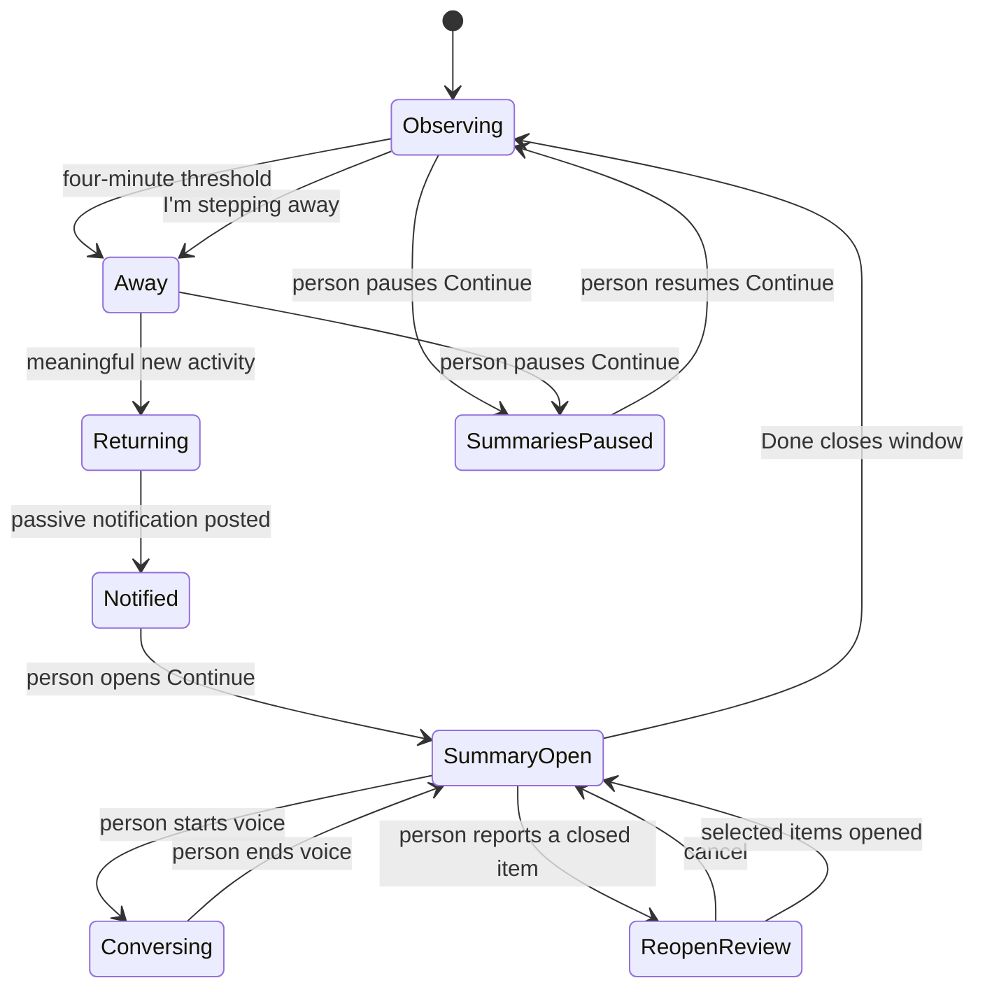

# Continue.ai Product Decisions and Integration Contract

Status: authoritative for the current macOS implementation as of September 12, 2026.

This document records the decisions made after reviewing the return flow from the user's perspective. If an older section of `IMPLEMENTATION_ARCHITECTURE.md` conflicts with this document, this document controls the product behavior.

## Product outcome

Continue helps a person recover mental context after leaving a computer. Continue does not normally recover operating-system state because the application, window, document, and browser tab that the person left often remain open.

The normal return flow is:

1. Screenpipe continues recording while its own recording setting is enabled.
2. Continue checks Screenpipe periodically without continuously running summarization.
3. Continue creates a checkpoint after four minutes away, or immediately when the person chooses **I'm stepping away**.
4. Continue detects new meaningful activity after the away period.
5. macOS displays a passive notification with the generic body **Your return summary is ready.**
6. The notification does not open Continue, focus Continue, switch applications, or start the microphone.
7. The person opens Continue from the notification or menu bar when they want the summary.
8. Continue shows the prior task, last action, next step, evidence source, and confidence.
9. The person may start a two-way voice conversation, edit the next step, dismiss the summary, or select **Done**.
10. **Done** closes the Continue window. Continue does not reopen or refocus the application that was already in front.

If an item actually closed, the person can select **Something closed?**. Continue then shows an optional reopen sheet. The sheet starts with nothing selected, warns that Continue cannot know whether every browser tab or file remains open, and opens only the items that the person selects and confirms.

## Locked user-facing decisions

| Area | Decision |
|---|---|
| Return alert | Use a passive macOS notification. Do not interrupt with sound, automatically show a window, or change focus. |
| Notification privacy | Use a generic notification body. Do not expose captured work details on the lock screen in the current implementation. |
| Permission prompt | Request notification permission only after the person selects **Enable return notifications** in Settings. Do not request permission during a return event. |
| Default return action | Show **Done**. Preserve the current application and windows. |
| Optional reopen action | Put **Something closed?** behind a secondary action. Start with zero selected targets and require confirmation. |
| Summary contents | Emphasize the prior task, last action, and next step. Display source and confidence. |
| Corrections | Allow the person to edit the next step or dismiss the summary. Keep preview corrections in memory for the current app session. |
| Voice | Start only after an explicit click. Support a natural two-way conversation, not automatic one-way playback. |
| Waveform | Represent disconnected, connecting, listening, thinking, speaking, muted, and failed voice states. Respect Reduce Motion and retain a text state label. |
| Away threshold | Default to four minutes. Allow a one-minute to sixty-minute setting and a manual away action. |
| History | Retain interpreted checkpoints for seven days by default. Screenpipe controls retention of its own raw data. |
| App presence | Keep a menu-bar control available. Use the full window for the current summary, history, and settings. |
| Service failure | State clearly when Screenpipe is unavailable. Label deterministic fixtures as preview data. |
| Demo outcome | Leave, return, receive an accurate summary, optionally converse, and continue working without unnecessary application restoration. |

## Capture, interpretation, and voice are separate states

Screenpipe and Continue are separate processes. A healthy Continue process does not prove that Screenpipe is recording. A healthy Screenpipe process does not prove that Continue summaries are enabled.

The interface therefore reports two independent states:

- **Screenpipe recording: On / Paused / Off / Checking** describes the external capture service.
- **Continue summaries: On / Paused** describes whether Continue interprets Screenpipe activity and creates checkpoints.

Selecting **Pause Continue summaries** must not claim or imply that Screenpipe stopped. The current implementation does not expose **Pause all capture** because the team has not verified a reliable Screenpipe control API for that operation.

The microphone is a third independent state. Continue starts the microphone only when the person selects **Start conversation**, and it stops when the person selects **End** or disables voice conversations.

```mermaid
flowchart LR
    SP[Screenpipe process\nrecording while enabled] -->|local bounded API| POLL[Continue runtime poll\nevery 30-60 seconds]
    POLL --> STATE[away and return state]
    STATE -->|four minutes idle\nor manual away| CP[compact checkpoint]
    CP -->|new activity after away| NOTIFY[passive generic notification]
    NOTIFY -->|person opens Continue| UI[written return summary]
    UI -->|explicit click| VOICE[two-way voice conversation]
    UI -->|only if something closed| REVIEW[optional reopen review]
    REVIEW -->|selected IDs plus confirmation| OPEN[open selected safe targets]
```



## State and focus rules

Continue must not infer absence from the foreground application alone. When a person leaves a computer, macOS normally keeps the same application in front. Process identifiers and application activation state therefore cannot establish whether the person is present or what task they were performing.

Screenpipe supplies the primary high-level activity data. A future native coordinator may use `NSWorkspace` activation, sleep, and wake notifications only as refresh hints. It must not create a checkpoint from process names alone.



No state transition in this diagram brings another application forward automatically. The optional reopen service performs an operating-system action only after an explicit target selection and confirmation.

## macOS implementation boundary

The product client remains isolated in `apps/macos/**` so the four workstreams can continue in parallel.

```text
apps/macos/
├── Sources/ContinueCore/
│   ├── versioned integration models
│   ├── runtime, checkpoint, voice, and reopen protocols
│   ├── deterministic preview providers
│   └── shared JSON contract fixtures
├── Sources/ContinueApp/
│   ├── AppModel and 30-second preview monitor
│   ├── menu-bar and full-window scenes
│   ├── return summary and correction UI
│   ├── optional reopen approval UI
│   ├── passive notification provider
│   └── voice waveform and conversation UI
├── ContractVerification/
│   └── TypeScript validation against shared package schemas
└── Tests/ContinueCoreChecks/
    └── deterministic Swift contract and behavior checks
```

The product client consumes service contracts and does not modify the implementation packages owned by other collaborators:

| Workstream | Owned implementation | Product consumes |
|---|---|---|
| Screenpipe/Data | `packages/screenpipe/**` | normalized activity, capture status, freshness, and evidence references |
| AI/Memory | `packages/context-engine/**`, `packages/memory/**` | validated checkpoint and history records |
| Voice | `packages/voice/**` and the configured voice provider | session state, levels, transcript behavior, and validated client tools |
| Product/Integration | `apps/macos/**` | the three contracts above through Swift protocols and JSON fixtures |

## Current verification status

The current native client uses the shared SQLite checkpoint database and the
official ElevenLabs voice provider. Screenpipe capture/runtime coordination,
model summarization, and real workspace opening remain explicit preview or
pending boundaries; the app does not silently substitute fixture checkpoints
when the database is empty.

The repository currently verifies the following behavior:

- Swift decodes the canonical checkpoint and normalized activity JSON fixtures.
- TypeScript validates the same checkpoint with the existing strict shared schema.
- The preview runtime keeps Screenpipe recording state separate from Continue summary state.
- Manual away changes the runtime phase without stopping capture.
- The four-minute and seven-day defaults are deterministic checks.
- The preview voice provider enters listening state only after an explicit start action.
- The reopen review starts with nothing selected and rejects unknown target identifiers.
- A corrected next step preserves the checkpoint identity and evidence.
- All Swift targets compile with warnings treated as errors.
- All eight TypeScript workspace projects pass type checking.

The latest local real-service probe found no Screenpipe server at `http://localhost:3030`. A collaborator must provide a running service and sanitized real response fixtures before the product workstream can verify live capture mapping. The Screenpipe adapter should follow the project's maintained [local API guidance](https://github.com/screenpipe/screenpipe/blob/main/crates/screenpipe-core/assets/skills/screenpipe-api/SKILL.md) and keep requests bounded by time and result count.

## Integration acceptance checks

The real adapters are ready for the product client only when this sequence passes:

1. Screenpipe reports its actual recording state and recent meaningful activity.
2. Continue polls without overlapping requests or continuous model inference.
3. Four minutes without meaningful activity produces exactly one checkpoint.
4. The manual away action produces the same durable away state without stopping Screenpipe.
5. New activity after away produces one passive notification and does not open or focus Continue.
6. The written summary identifies the task, last action, next step, evidence, and confidence.
7. Starting voice begins a two-way session and starting no other flow activates the microphone.
8. Editing or dismissing a summary changes only Continue's interpreted checkpoint state.
9. **Done** closes Continue without restoring application state.
10. **Something closed?** starts with no selected targets and opens only confirmed safe target IDs.

## Deliberately deferred work

- Low-level process enumeration as a primary activity source.
- Automatic focus changes or automatic workspace restoration.
- A Screenpipe stop button until its supported control interface is verified.
- Microphone activation before an explicit voice action.
- Arbitrary computer control, shell commands, code edits, commits, messages, or form submission from a checkpoint or voice tool.
- Persistence of raw screenshots or microphone samples in Continue's checkpoint store.
